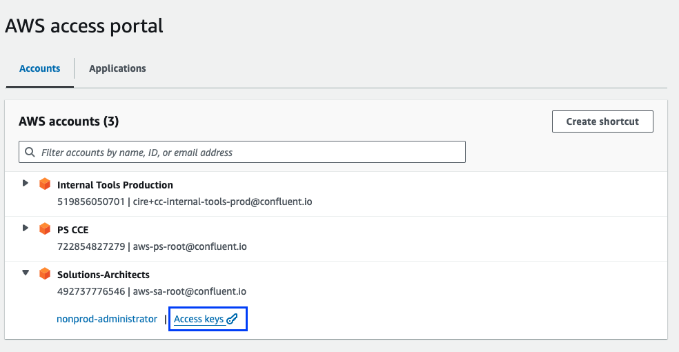
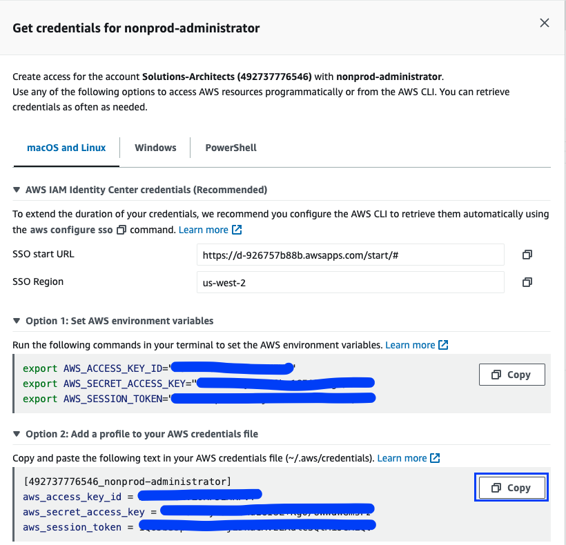

## Contents
- [Access](#Access)
 

### Access
Ref: https://confluentinc.atlassian.net/wiki/spaces/CIRE/pages/3024984353/Amazon+Web+Services+AWS+Access#Web-Console-Access

#### Login to AWS Portal 
[]()
#### Copy the AWS Profile & credentials
[]()

#### Paste the Credentials to $HOME/.aws/credentials file on your MAC 

```
[492737776546_nonprod-administrator]
aws_access_key_id=xxxxxxxxxxxxxxxxxxxxxxxx
aws_secret_access_key=yyyyyyyyyyyyyyyyyyyyyyyyy
aws_session_token=zzzzzzzzzzzzzzzzzzzzzzzzzzzzzzzzzzzzzzzzzzzzzzzzzzzzzzzzzzzzzzzz=
```
#### Run assume
```
[ssahu@mac ~/.aws ]# assume
? Please select the profile you would like to assume: 492737776546_nonprod-administrator
[i] To assume this profile again later without needing to select it, run this command:
> assume 492737776546_nonprod-administrator
[!] Profile 492737776546_nonprod-administrator has plaintext credentials stored in the AWS credentials file
[i] To move the credentials to secure storage, run 'granted credentials import 492737776546_nonprod-administrator'
[✔] [492737776546_nonprod-administrator](us-west-2) session credentials ready
```
#### Verify
```
[ssahu@mac ~/.aws ]# aws sts get-caller-identity | jq -r .Arn
arn:aws:sts::492737776546:assumed-role/AWSReservedSSO_nonprod-administrator_6bbd747b1460f5f4/srsahu@confluent.io
```

#### Copy Credentials to the VM and Validate
```
[ssahu@mac ~/.aws ]# scp credentials awsvm:/home/ubuntu/.aws
credentials                                     100% 1671    10.7KB/s   00:00
```
```
[ubuntu@awst2x ~/.aws]# export AWS_PROFILE=492737776546_nonprod-administrator
```
```
[ubuntu@awst2x ~/.aws]# aws ec2 describe-availability-zones --query 'AvailabilityZones[*].[ZoneName, ZoneId]' --region us-east-2 --output text
us-east-2a      use2-az1
us-east-2b      use2-az2
us-east-2c      use2-az3
```

