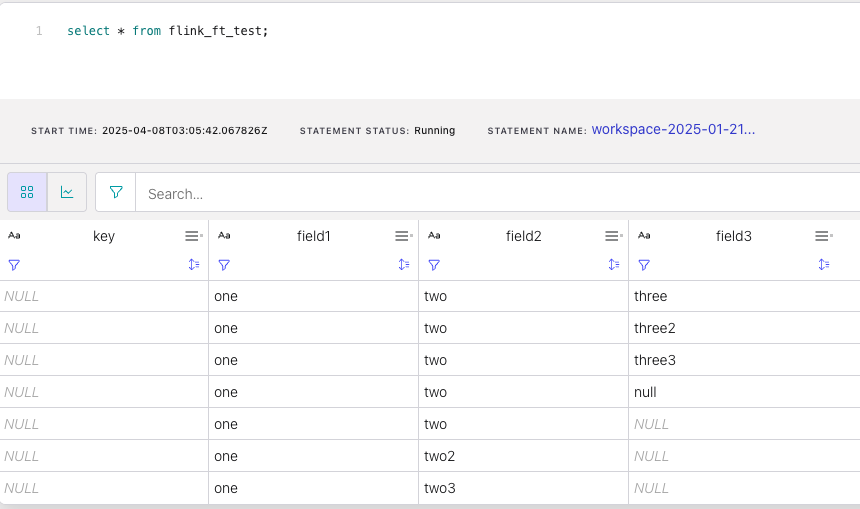

# Flink
Among stream processing frameworks, Apache Flink has emerged as the de facto standard because of its performance and rich feature set.
- Four courner stones of Flink
    - Streaming
        - Patterns: Parallel, Forward, Repartition, Rebalance(expensive), broadcasting, joining
    - State
    - Time
    - Snapshots
- Flink APIs
    - Flink SQL : High-level, declarative API that allows you to write SQL queries to process data streams and batch data as dynamic 
    - Table API (dynamic tables) : Programmatic equivalent of Flink SQL, allowing you to define your business logic in either Java or Python, or combine it with SQL
    - DataStream API (streams, windows) : Low-level, expressive API that exposes the building blocks for stream processing, giving you direct access to things like state amd timers.
    - Process Functions (events, state, time ) : The most low-level API, allowing for fine-grained processing of individual elements for complex event-driven processing logic and state management.
- Stream Vs Batch
    - Stream Only - Order by time only possible (set 'execution.runtime-mode' = 'streaming';)
        - Bounded & Unbounded Streams
        - Results are reported as they are ready
        - Failure recovery resumes from recent snapshot
        - Guarantees Exactly once results - despite out of order data and restarts due to failures
        - Powerful ( can do any thing that batch processing does ) 
    - Batch Only - Order by anything you like (set 'execution.runtime-mode' = 'batch';)
        - Bounded streams only
        - Results are reported at the end
        - Failure recovery does a reset and full restart
        - Guarantees Exactly once results  
        - Efficient ( Cant replace streaming )

  
## Contents
- [RBAC](#RBAC)
- [CLI](#CLI)
    - [Compute Pool](#Compute-Pool) 
- [SQL](#SQL)
    - [Show](#Show)
    - [Set Reset](#Set-Reset)
    - [Create Table](#Create-Table)
    - [Create Table Mock Data](#Create-Table-Mock-Data)
    - [Alter Table](#Alter-Table)
    - [Kafka topic metadata](#Kafka-topic-metadata)
    - [Combine Tables](#Combine-Tables)
    - [Statements](#Statements)
- [Modes](#Modes)
- [REST API](#REST-API)
- [Limitations](#Limitations)
- [Sizing](#Sizing)
- [Full Transitive Schema ](#Full-Transitive-Schema)
- [Monitoring](#Monitoring)

  
## RBAC
Confluent Cloud for Apache Flink supports the following RBACs for manaing Flink resoures.
- FlinkAdmin - Enables full access to Flink resources in an environment.
- FlinkDeveloper - Enable limited access to flink resources. For users who run Flink statements but don't manage compute pools.
- Assigner - Grant this role a user account that needs role binding on a service account to run Flink staements with a service principal.

Grant FlinkAdmin role to a user
```
confluent iam rbac role-binding create \
  --environment env-xyz \
  --principal User:u-xyz \
  --role FlinkAdmin
```

Grant Assigner role to acess the service account.
```
confluent iam rbac role-binding create \
  --principal User:u-xyz \
  --resource service-account:sa-xyz \
  --role Assigner
```

## CLI
### Compute Pool
A compute pool in Confluent Cloud for Apache Flink® represents a set of compute resources bound to a region that is used to run your SQL statements.  

The capacity of a compute pool is measured in CFUs. Compute pools expand and shrink automatically based on the resources required by the statements using them. A compute pool without any running statements scale down to zero. The maximum size of a compute pool is configured during creation.

A compute pool is provisioned in a specific region. The statements using a compute pool can only read and write Apache Kafka® topics in the same region as the compute pool.
#### Create a compute-pool 
```
> confluent flink compute-pool create flinkpool --cloud aws --region us-east-1 --max-cfu 5

+-------------+--------------+
| Current     | false        |
| ID          | lfcp-kj579m  |
| Name        | flinkpool    |
| Environment | env-z3y7v3   |
| Current CFU | 0            |
| Max CFU     | 5            |
| Cloud       | AWS          |
| Region      | us-east-1    |
| Status      | PROVISIONING |
+-------------+--------------+
```
#### Delete a compute-pool
```
> confluent flink compute-pool delete lfcp-kj579m

Are you sure you want to delete Flink compute pool "lfcp-kj579m"?
To confirm, type "flinkpool". To cancel, press Ctrl-C: flinkpool
Deleted Flink compute pool "lfcp-kj579m".
```
#### List compute-pools in your environment.
```
> confluent flink compute-pool list

  Current |     ID      |    Name     | Environment | Current CFU | Max CFU | Cloud |  Region   |   Status     
----------+-------------+-------------+-------------+-------------+---------+-------+-----------+--------------
  *       | lfcp-j9kzgw | srini-flink | env-z3y7v3  |           0 |       5 | AWS   | us-east-2 | PROVISIONED  
```

#### Update compute-pool
```
> confluent flink compute-pool update lfcp-j9kzgw --max-cfu 10
+-------------+-------------+
| Current     | true        |
| ID          | lfcp-j9kzgw |
| Name        | srini-flink |
| Environment | env-z3y7v3  |
| Current CFU | 0           |
| Max CFU     | 10          |
| Cloud       | AWS         |
| Region      | us-east-2   |
| Status      | PROVISIONED |
+-------------+-------------+
```
## SQL
A standards-compliant SQL engine for processing both batch and streaming data with the scalability, performance and consistence of Apache Flink.
Refer to this document for comprehensive information : https://docs.confluent.io/cloud/current/flink/reference/overview.html

### show 
Enables listing available Flink databases, catalogs, and tables.
> Note: CATALOG = kafka-environment-name, DATABASE= kafka-cluster-name, TABLE= topic-name.   CDT in Flink = EKT in Kafka
```
[terminal] > confluent flink compute-pool use lfcp-j9kzgw
[terminal] > confluent flink shell
> show catalogs;
 
+---------------------------------------------+--------------+
|                Catalog Name                 |  Catalog ID  |
+---------------------------------------------+--------------+
| examples                                    | cat-examples |
| new_env                                     | env-0jnyv6   |
| ccloud-stack-sa-rrx6nk-microservices-orders | env-0no19    |
| la-cloud-env                                | env-1057v    |
| Saif_demo_env                               | env-3nkdpm   |
| SManjakuppamtechsumit-ff51a947              | env-9z6v27   |
| svalluri-0                                  | env-d19r27   |
| rsubramanian-test                           | env-k80ogv   |
| smanjakuppam-test                           | env-knkwkm   |
| ccloud-stack-sa-5wrmwz-data-mesh-demo       | env-mvooo2   |
| default                                     | env-oxg9p    |
| test                                        | env-pj6p2m   |
| rrchakawsdevtf                              | env-v6w2mz   |
| srinivas                                    | env-y65pxp   |
| uat                                         | env-yg5x9p   |
+---------------------------------------------+--------------+

> use catalog srinivas;
+---------------------+----------+
|         Key         |  Value   |
+---------------------+----------+
| sql.current-catalog | srinivas |
+---------------------+----------+

> show databases;
+---------------+-------------+
| Database Name | Database ID |
+---------------+-------------+
| test          | lkc-86p6xm  |
+---------------+-------------+

> use lkc-86p6xm;
+----------------------+------------+
|         Key          |   Value    |
+----------------------+------------+
| sql.current-database | lkc-86p6xm |
+----------------------+------------+

> show current catalog;
+----------------------+
| Current Catalog Name |
+----------------------+
| srinivas             |
+----------------------+

> show current database;
+-----------------------+
| Current Database Name |
+-----------------------+
| lkc-86p6xm            |
+-----------------------+

> show tables;
+------------------------+
|       Table Name       |
+------------------------+
| complex-avro           |
| firehose-multi-schema  |
| firehose-single-schema |
| flink_pageviews        |
| multi-schema-orgid-001 |
| multi-schema-orgid-002 |
| orgid_001              |
| orgid_002              |
| test-avro              |
| test-multi-schema      |
| xyz                    |
+------------------------+
```

### Show Functions
```
> show functions like 'AR%';
+-----------------+
|  function name  |
+-----------------+
| ARRAY           |
| ARRAY_AGG       |
| ARRAY_APPEND    |
| ARRAY_CONCAT    |
| ARRAY_CONTAINS  |
| ARRAY_DISTINCT  |
| ARRAY_EXCEPT    |
| ARRAY_INTERSECT |
| ARRAY_JOIN      |
| ARRAY_MAX       |
| ARRAY_MIN       |
| ARRAY_POSITION  |
| ARRAY_PREPEND   |
| ARRAY_REMOVE    |
| ARRAY_REVERSE   |
| ARRAY_SLICE     |
| ARRAY_SORT      |
| ARRAY_UNION     |
+-----------------+
```
Use ILIKE to ingore case.
```
> show functions ilike 'array_d%';
+----------------+
| function name  |
+----------------+
| ARRAY_DISTINCT |
+----------------+
```
### Set Reset
Modify or list the Flink SQL shell configuration 
```
> set;
Statement successfully submitted.
Statement phase is COMPLETED.
+------------------------+---------------------+
|          Key           |        Value        |
+------------------------+---------------------+
| client.output-format   | standard (default)  |
| client.service-account | <unset> (default)   |
| sql.current-catalog    | srinivas            |
| sql.current-database   | lkc-86p6xm          |
| sql.local-time-zone    | GMT+00:00 (default) |
+------------------------+---------------------+
```
⚠️ set; is not supported in cloud console workspaces.

Modify
```
SET 'sql.current-catalog' = 'default';
SET 'sql.current-database' = 'cluster_0';
SELECT * FROM pageviews;
```
Reset
Reset the Flink SQL shell configuration to the default settings
```
RESET 'table.local-time-zone';
```
### Create Table
> These are the changelog modes for an inferred table:
>> append (if uncompacted)
   upsert (if compacted)
>
> These are the changelog modes for a manually created table:
>> retract (without primary key)
   upsert (with primary key and/or compaction)

```
> CREATE TABLE shoe_order_customer_product(
  order_id INT,
  first_name STRING,
  last_name STRING,
  email STRING,
  brand STRING,
  `model` STRING,
  sale_price INT,
  rating DOUBLE
)WITH (
    'changelog.mode' = 'retract'
);

> SHOW CREATE TABLE shoe_order_customer_product(

CREATE TABLE `handson-flink`.`handson-flink`.`shoe_order_customer_product` (
  `order_id` INT,
  `first_name` VARCHAR(2147483647),
  `last_name` VARCHAR(2147483647),
  `email` VARCHAR(2147483647),
  `brand` VARCHAR(2147483647),
  `model` VARCHAR(2147483647),
  `sale_price` INT,
  `rating` DOUBLE
) DISTRIBUTED INTO 6 BUCKETS
WITH (
  'changelog.mode' = 'retract',
  'connector' = 'confluent',
  'kafka.cleanup-policy' = 'delete',
  'kafka.max-message-size' = '2097164 bytes',
  'kafka.retention.size' = '0 bytes',
  'kafka.retention.time' = '7 d',
  'scan.bounded.mode' = 'unbounded',
  'scan.startup.mode' = 'earliest-offset',
  'value.format' = 'avro-registry'
)
```
### Create Table Mock Data
```
CREATE TABLE `mock_table` (
  `city` VARCHAR(2147483647),
  `merchant_name` VARCHAR(2147483647),
  `min_transaction_value` DECIMAL(10, 2),
  `discount_amount` DECIMAL(10, 2),
  `timestamp` TIMESTAMP(3) WITH LOCAL TIME ZONE
)
DISTRIBUTED INTO 6 BUCKETS
WITH (
  'changelog.mode' = 'append',
  'connector' = 'faker',
  'fields.city.expression' = '#{Options.option ''New York'',''Los Angeles'',''Chicago'',''Charlotte '',''San Francisco''}',
  'fields.discount_amount.expression' = '#{NUMBER.numberBetween ''2'',''20''}',
  'fields.merchant_name.expression' = '#{Options.option ''Walmart Inc.'', ''Amazon.com Inc.'', ''CVS Health'', ''Costco Wholesale Corporation''}',
  'fields.min_transaction_value.expression' = '#{NUMBER.numberBetween ''500'',''1000''}',
  'rows-per-second' = '5'
)
```
### Describe Table
```
> describe `examples`.`marketplace`.`clicks`;
+-------------+-----------+----------+--------+
| Column Name | Data Type | Nullable | Extras |
+-------------+-----------+----------+--------+
| click_id    | STRING    | NOT NULL |        |
| user_id     | INT       | NOT NULL |        |
| url         | STRING    | NOT NULL |        |
| user_agent  | STRING    | NOT NULL |        |
| view_time   | INT       | NOT NULL |        |
+-------------+-----------+----------+--------+

> describe extended `examples`.`marketplace`.`clicks`;
+-------------+----------------------------+----------+-----------------------------------------------------+---------+
| Column Name |         Data Type          | Nullable |                       Extras                        | Comment |
+-------------+----------------------------+----------+-----------------------------------------------------+---------+
| click_id    | STRING                     | NOT NULL |                                                     |         |
| user_id     | INT                        | NOT NULL |                                                     |         |
| url         | STRING                     | NOT NULL |                                                     |         |
| user_agent  | STRING                     | NOT NULL |                                                     |         |
| view_time   | INT                        | NOT NULL |                                                     |         |
| $rowtime    | TIMESTAMP_LTZ(3) *ROWTIME* | NOT NULL | METADATA VIRTUAL, WATERMARK AS `SOURCE_WATERMARK`() | SYSTEM  |
+-------------+----------------------------+----------+-----------------------------------------------------+---------+
```
ℹ️ The annotation METADATA VIRTUAL indicates that this column is read-only.
WATERMARK AS `SOURCE_WATERMARK`() indicates that there is a watermark strategy defined on this $rowtime field,
and it is the default watermark strategy provided by Confluent Cloud.

### Alter Table
#### Read topic from specific offsets
```
-- Create example topic with 1 partition filled with values
CREATE TABLE t_specific_offsets (i INT) DISTRIBUTED INTO 1 BUCKETS;
INSERT INTO t_specific_offsets VALUES (1), (2), (3), (4), (5);

-- Returns 1, 2, 3, 4, 5
SELECT * FROM t_specific_offsets;

-- Changes the scan range
ALTER TABLE t_specific_offsets SET (
  'scan.startup.mode' = 'specific-offsets',
  'scan.startup.specific-offsets' = 'partition:0,offset:3'
);
-- Returns 4, 5
SELECT * FROM t_specific_offsets;
```
ℹ️ You can also specify multiple partitions, offsets as shown below
```
'scan.startup.specific-offsets' = 'partition:0,offset:3; partition:1,offset:42; partition:2,offset:0'
```
OR you can use a inline hint  

offsets based hint
```
SELECT customer_id, name, address, postcode, city, email
    FROM customers_source
    /*+ OPTIONS(
        'scan.startup.mode' = 'specific-offsets',
        'scan.startup.specific-offsets'  = 'partition:0,offset:10;partition:1,offset:123'
    ) */;
```
timestamp based hint
```
SELECT customer_id, name, address, postcode, city, email
    FROM customers_source
    /*+ OPTIONS(
        'scan.startup.mode' = 'timestamp',
        'scan.startup.timestamp-millis' = '1678886400000'
    ) */;
```
#### Read and/or write Kafka headers
```
-- Create example topic
CREATE TABLE t_headers (i INT);

-- For read-only (i.e. virtual)
ALTER TABLE t_headers ADD headers MAP<BYTES, BYTES> METADATA VIRTUAL;

-- For read and write (i.e. persisted). Column becomes mandatory in INSERT INTO.
ALTER TABLE t_headers MODIFY headers MAP<BYTES, BYTES> METADATA;

-- Use implicit casting (origin is always MAP<BYTES, BYTES>)
ALTER TABLE t_headers MODIFY headers MAP<STRING, STRING> METADATA;

DESCRIBE t_headers
+-------------+---------------------+----------+----------+
| Column Name |      Data Type      | Nullable |  Extras  |
+-------------+---------------------+----------+----------+
| i           | INT                 | NULL     |          |
| headers     | MAP<STRING, STRING> | NULL     | METADATA |
+-------------+---------------------+----------+----------+

-- Insert and read
INSERT INTO t_headers SELECT 42, MAP['k1', 'v1', 'k2', 'v2'];
```
Query the data inserted
```
SELECT * FROM t_headers;

i  headers                                                                                                                                                                               ║
42 {k1=v1, k2=v2}
```
### Kafka topic metadata 
Add kafka topic metadata as columns
```
ALTER TABLE `t_table` ADD pnum INT METADATA FROM 'partition' VIRTUAL;
SELECT pnum, * from t_table;
ALTER TABLE `t_table` DROP pnum;
```

Adds pnum metadata column that is not part of Schema Registry but a pure Flink concept

When declared as a METADATA column, it is part of SELECT * and is writable.
When declared as a METADATA VIRTUAL column, it is not part of SELECT * and is READ only.

This doesnt work with CDC sources

⚠️ The metadata column(s): 'pnum' in cdc source may cause wrong result or error on downstream operators, please consider removing these columns or use a non-cdc source that only has insert messages.
 
### Combine Tables

```
CREATE TABLE t_union_1 (i INT);
CREATE TABLE t_union_2 (i INT);
TABLE t_union_1 UNION ALL TABLE t_union_2;
```
OR
```
SELECT * FROM t_union_1
UNION ALL
SELECT * FROM t_union_2;
```

### Statements
#### Show Running Statements
```
> confluent flink statement list --status running --cloud aws --region us-east-1
          Creation Date          |                            Name                            |             Statement              | Compute Pool | Status  | Status Detail
---------------------------------+------------------------------------------------------------+------------------------------------+--------------+---------+----------------
  2024-11-11 23:03:18.006706     | cli-2024-11-11-230317-7fc0f3e6-5b1d-46c9-a3ad-2da1edb0d5da | insert into `some_clicks`          | lfcp-66q6j6  | RUNNING |
  +0000 UTC                      |                                                            | select   1 as partition_key,       |              |         |
                                 |                                                            |    user_id,   url,                 |              |         |
                                 |                                                            | $rowtime as event_time from        |              |         |
                                 |                                                            | `examples`.`marketplace`.`clicks`  |              |         |
                                 |                                                            | limit 500;                         |              |         |
  2024-11-12 00:07:50.446116     | cli-2024-11-12-000750-de2c83c6-96a2-4753-a018-5b42a3e96a51 | insert into `ooo_clicks`           | lfcp-66q6j6  | RUNNING |
  +0000 UTC                      |                                                            | select   user_id,   url,           |              |         |
                                 |                                                            |   TIMESTAMPADD(SECOND,             |              |         |
                                 |                                                            | rand_integer(6), $rowtime)         |              |         |
                                 |                                                            | as event_time from                 |              |         |
                                 |                                                            | `examples`.`marketplace`.`clicks`; |              |         |
```

#### Delete Statements
```
> confluent flink region use --cloud aws --region us-east-1
Using Flink region "N. Virginia (us-east-1)".

> confluent flink statement delete cli-2024-11-11-230317-7fc0f3e6-5b1d-46c9-a3ad-2da1edb0d5da
Are you sure you want to delete Flink SQL statement "cli-2024-11-11-230317-7fc0f3e6-5b1d-46c9-a3ad-2da1edb0d5da"? (y/n): y
Deleted Flink SQL statement "cli-2024-11-11-230317-7fc0f3e6-5b1d-46c9-a3ad-2da1edb0d5da".
```

#### DryRun Statements
Dry run mode allows to test a statement before real submission. The dry run will pass both SQL Service and SQL Metastore in read-only mode.

It neither creates a Flink job, nor creates catalog object, nor Kafka topics/Schema Registry subjects

```
SET 'sql.dry-run' = 'true';
CREATE TABLE sample_table (i INT);
```

## Modes

scan.startup.mode
```
set 'scan.startup.mode' = 'earliest-offset';
set 'scan.startup.mode' = 'latest-offset';
set 'scan.startup.mode' = 'specific-offsets';
set 'scan.startup.mode' = 'timestamp';
```
execution.runtime-mode : streaming | batch
```
set 'execution.runtime-mode' = 'streaming';
set 'execution.runtime-mode' = 'batch';
```
execution.result-mode: changelog | table
```
set 'sql-client.execution.result-mode' = 'changelog';
set 'sql-client.execution.result-mode' = 'table';
```


## REST API
### Delete compute-pool 
```
curl --request DELETE \
--url 'https://api.confluent.cloud/fcpm/v2/compute-pools/lfcp-j9kzgw?environment=env-z3y7v3' \
--header 'Authorization: Basic '$CLOUD_AUTH64'' \
--header 'content-type: application/json'
```
### List compute-pool region 
#### List all regions in AWS Cloud
```
curl --request GET --url 'https://api.confluent.cloud/fcpm/v2/regions?cloud=AWS' --header 'Authorization: Basic '$CLOUD_AUTH64'' --header 'content-type: application/json'
```
#### List region us-east-2 in AWS Cloud
```
curl --request GET --url 'https://api.confluent.cloud/fcpm/v2/regions?cloud=AWS&region_name=us-east-2' --header 'Authorization: Basic '$CLOUD_AUTH64'' --header 'content-type: application/json'
{
  "api_version": "fcpm/v2",
  "data": [
    {
      "api_version": "fcpm/v2",
      "cloud": "aws",
      "display_name": "Ohio (us-east-2)",
      "http_endpoint": "https://flink.us-east-2.aws.confluent.cloud",
      "id": "aws.us-east-2",
      "kind": "Region",
      "metadata": {
        "self": ""
      },
      "region_name": "us-east-2"
    }
  ],
  "kind": "RegionList",
  "metadata": {
    "first": "",
    "next": "",
    "total_size": 1
  }
}
```
### Create statement
> Make sure the User has the right RBAC and Basic auth is from key/secret with right resource
```
> confluent iam rbac role-binding list --principal User:u-1jqq8v --inclusive

   ID   |  Principal  |       Email        |    Role    | Environment | Cloud Cluster | Cluster Type | Logical Cluster | Resource Type |  Name   | Pattern Type  
------------+---------------+----------------------------------+-------------------+-------------+---------------+--------------+-----------------+---------------+-------------+---------------
 rb-AB2rD1 | User:u-1jqq8v | srsahu+svcs-central@confluent.io | FlinkDeveloper  | env-z3y7v3 |        |       |         | Compute-Pool | lfcp-mz311w | LITERAL    
 rb-ABjmMe | User:u-1jqq8v | srsahu+svcs-central@confluent.io | FlinkAdmin    | env-z3y7v3 |        |       |         |        |       |

> confluent api-key create  --resource flink --cloud aws --region us-east-2
```
 
```
> curl --request POST \
--url 'https://flink.us-east-2.aws.confluent.cloud/sql/v1beta1/organizations/4c8541f7-cc3f-44af-a366-ad4de432fe24/environments/env-z3y7v3/statements' \
--header 'Authorization: Basic '$FLINK_AUTH64'' \
--header 'content-type: application/json' \
--data '@statement_create.json'

{
  "api_version": "sql/v1beta1",
  "environment_id": "env-z3y7v3",
  "kind": "Statement",
  "metadata": {
    "created_at": "2024-03-11T20:08:01.345637Z",
    "resource_version": "1",
    "self": "https://flink.us-east-2.aws.confluent.cloud/sql/v1beta1/organizations/4c8541f7-cc3f-44af-a366-ad4de432fe24/environments/env-z3y7v3/statements/flink-test",
    "uid": "75b61701-7154-4bb4-8ad6-8b507a37ffa5",
    "updated_at": "2024-03-11T20:08:01.345637Z"
  },
  "name": "flink-test",
  "organization_id": "4c8541f7-cc3f-44af-a366-ad4de432fe24",
  "spec": {
    "compute_pool_id": "lfcp-mz311w",
    "principal": "u-1jqq8v",
    "properties": {
      "sql.current-catalog": "env-z3y7v3",
      "sql.current-database": "lkc-1w9gn5"
    },
    "statement": "SELECT * FROM TABLE WHERE VALUE1 = VALUE2;",
    "stopped": false
  },
  "status": {
    "detail": "",
    "phase": "PENDING",
    "result_schema": {}
  }
}
```
### Query statement in compute pool

```
> curl --request GET \
--url 'https://flink.us-east-2.aws.confluent.cloud/sql/v1beta1/organizations/4c8541f7-cc3f-44af-a366-ad4de432fe24/environments/env-z3y7v3/statements/711a0c54-5c03-49e1' \
--header 'Authorization: Basic '$FLINK_AUTH64'' \
--header 'content-type: application/json'

{
  "api_version": "sql/v1beta1",
  "environment_id": "env-z3y7v3",
  "kind": "Statement",
  "metadata": {
    "created_at": "2024-03-09T05:36:34.935007Z",
    "resource_version": "39",
    "self": "https://flink.us-east-2.aws.confluent.cloud/sql/v1beta1/organizations/4c8541f7-cc3f-44af-a366-ad4de432fe24/environments/env-z3y7v3/statements/711a0c54-5c03-49e1",
    "uid": "3dcdf5d2-b58e-492a-bd08-c0d2c16389ba",
    "updated_at": "2024-03-11T19:29:32.944902Z"
  },
  "name": "711a0c54-5c03-49e1",
  "organization_id": "4c8541f7-cc3f-44af-a366-ad4de432fe24",
  "spec": {
    "compute_pool_id": "lfcp-mz311w",
    "principal": "u-1jqq8v",
    "properties": {
      "sql.current-catalog": "srsahu-env",
      "sql.current-database": "srini-basic",
      "sql.local-time-zone": "GMT+00:00"
    },
    "statement": "select * from prod_test_topic\n;",
    "stopped": true
  },
  "status": {
    "detail": "This statement was stopped manually.",
    "phase": "STOPPED",
    "result_schema": {
      "columns": [
        {
          "name": "key",
          "type": {
            "length": 2147483647,
            "nullable": true,
            "type": "VARBINARY"
          }
        },
        {
          "name": "val",
          "type": {
            "length": 2147483647,
            "nullable": true,
            "type": "VARBINARY"
          }
        }
      ]
    },
    "scaling_status": {
      "last_updated": "2024-03-09T05:37:03Z",
      "scaling_state": "OK"
    }
  }
}
```

### Query statement results from compute pool
```
> curl --request GET --url 'https://flink.us-east-2.aws.confluent.cloud/sql/v1beta1/organizations/4c8541f7-cc3f-44af-a366-ad4de432fe24/environments/env-z3y7v3/statements/711a0c54-5c03-49e1/results' \
--header 'Authorization: Basic '$FLINK_AUTH64'' \
--header 'content-type: application/json'

{
  "api_version": "sql/v1beta1",
  "kind": "StatementResult",
  "metadata": {
    "created_at": "2024-03-11T19:29:32.956528382Z",
    "next": "https://flink.us-east-2.aws.confluent.cloud/sql/v1beta1/organizations/4c8541f7-cc3f-44af-a366-ad4de432fe24/environments/env-z3y7v3/statements/711a0c54-5c03-49e1/results?page_token=eyJWZXJzaW9uIjoiIiwiT2Zmc2V0IjowfS43YjIyNTY2NTcyNzM2OTZmNmUyMjNhMjIyMjJjMjI0ZjY2NjY3MzY1NzQyMjNhMzA3ZGZiZGIxZDFiMThhYTZjMDgzMjRiN2Q2NGI3MWZiNzYzNzA2OTBlMWQ",
    "self": "https://flink.us-east-2.aws.confluent.cloud/sql/v1beta1/organizations/4c8541f7-cc3f-44af-a366-ad4de432fe24/environments/env-z3y7v3/statements/711a0c54-5c03-49e1/results"
  },
  "results": {
    "data": null
  }
}

```
### List Statements
```
curl --request GET \
--url 'https://flink.us-east-2.aws.confluent.cloud/sql/v1beta1/organizations/4c8541f7-cc3f-44af-a366-ad4de432fe24/environments/env-z3y7v3/statements' \
--header 'Authorization: Basic '$FLINK_AUTH64'' \
--header 'content-type: application/json' 
```
### Delete Statement
> 200 is success
```
curl --request DELETE \
--url 'https://flink.us-east-2.aws.confluent.cloud/sql/v1beta1/organizations/4c8541f7-cc3f-44af-a366-ad4de432fe24/environments/env-z3y7v3/statements/711a0c54-5c03-49e1' \
--header 'Authorization: Basic '$FLINK_AUTH64'' \
--header 'content-type: application/json' 
```

## Limitations
### offset start
You cannot set the offset for a job. This is an WITH option to be used when creating table.

Job
```
> set 'scan.startup.mode'='earliest-offset';
Statement successfully submitted.
Statement phase is COMPLETED.
configuration updated successfully.
+-------------------+-----------------+
|        Key        |      Value      |
+-------------------+-----------------+
| scan.startup.mode | earliest-offset |
+-------------------+-----------------+
> SELECT * FROM game_data;
Statement name: f5ab9fd7-7387-478a
Statement successfully submitted.
Waiting for statement to be ready. Statement phase is PENDING.
Error: can't fetch results. Statement phase is: FAILED
Error details: Unsupported configuration options found.
```
Table
```

```

## Sizing
### Terminology
RPS - Records Per Second ( in and out ) processed by long-running INSERT statements
Target - The workload statement that is the subject of a benchmark.

### Rule of thumb
Statement throughput generally scales lineraly in the number of CFUs available to a statement. The exception to this rule is when UDFs are used. 
Otherwise  doubling the CFUs for a given statement will double the amount of throughput it gets.

One statement will always consume a minimum of 1 CFU, regardless of the work it's performing.

### Estimation
Run the sql statement of your workload on a 1 CFU cluster and identify its peak performance, with a acceptable MEssages Behind Records ( available on console )
If 1 CFU allows you to achieve 5000 RPS and the workload requires 10000 RPS, you can safely estimate 2 CFUs for this workload.

Repeat this exercise for all workloads and arrive at the total CFUs needed for all workloads combined. 

### Scaling
CFU estimation is a upper limit of your cluster.
Autopilot takes care of all the work required to scale up or scale down the compute resources that a SQL statement consumes. Resources are scaled up when a SQL statement has an increased need for resources and scaled down when resources are not being used. 
Flink scales-to-zero , meaning if no statements are running you will not be billed for any flink usage. You pay only what you use, not what you provision.

Refer: https://docs.confluent.io/cloud/current/flink/concepts/autopilot.html#flink-sql-autopilot-for-ccloud

## Testing
### Full Transitive Schema
1. Create a topic
```
> confluent kafka topic create  flink_ft --partitions 1
```
2. Create a schema
```
{
  "fields": [
    {
      "default": null,
      "name": "field1",
      "type": [
        "null",
        "string"
      ]
    },
    {
      "default": null,
      "name": "field2",
      "type": [
        "null",
        "string"
      ]
    },
    {
      "default": null,
      "name": "field3",
      "type": [
        "null",
        "string"
      ]
    }
  ],
  "name": "flink_full_transitive",
  "namespace": "io.confluent.examples",
  "type": "record"
}
```
3. Produce
```
kafka-avro-console-producer --bootstrap-server pkc-09zmdp.us-east-1.aws.confluent.cloud:9092 \
--producer.config java.config --topic flink_ft --property value.schema.id=100053 \
--property basic.auth.credentials.source="USER_INFO" \
--property schema.registry.url="https://psrc-1ymy5nj.us-east-1.aws.confluent.cloud" \
--property schema.registry.basic.auth.user.info="xxxxxx:ssssssssssssss"
{"field1": { "string": "one"}, "field2": { "string": "two"} , "field3": { "string" : "three"}}
{"field1": { "string": "one"}, "field2": { "string": "two"} , "field3": { "string" : "three2"}}
{"field1": { "string": "one"}, "field2": { "string": "two"} , "field3": { "string" : "three3"}}
```
4. Create Flink Table
```
create table flink_ft_test as select * from flink_ft;
select * from flink_ft_test
```
5. Evolve the Schema
```
{
  "fields": [
    {
      "default": null,
      "name": "field1",
      "type": [
        "null",
        "string"
      ]
    },
    {
      "default": null,
      "name": "field2",
      "type": [
        "null",
        "string"
      ]
    }
  ],
  "name": "flink_full_transitive",
  "namespace": "io.confluent.examples",
  "type": "record"
}
```
6. Produce
New Schema ID: 100056
```
kafka-avro-console-producer --bootstrap-server pkc-09zmdp.us-east-1.aws.confluent.cloud:9092 \
--producer.config java.config --topic flink_ft --property value.schema.id=100056 \
--property basic.auth.credentials.source="USER_INFO" \
--property schema.registry.url="https://psrc-1ymy5nj.us-east-1.aws.confluent.cloud" \
--property schema.registry.basic.auth.user.info="MYR2BLXPM3KK4Q6T:F3uffqcym2gzkAYCzT3cJnzuuDo3mduQUZP1vgFFo/BuR0SnWUCG9N4i1+NWS4h3"

{"field1": { "string": "one"}, "field2": { "string": "two"}}
{"field1": { "string": "one"}, "field2": { "string": "two2"}}
{"field1": { "string": "one"}, "field2": { "string": "two3"}}
```
7. Validate
Confirm the flink statement is able to write rows to the table for both the schemas - YES

[]()
## Monitoring

Confluent Cloud Metrics API offers two resources to monitor your Flink workloads 1. Compute Pool 2. Flink Statements

To monitor resources at the statement level set the statement name
```
SET 'client.statement-name' = '<statement-name>'
```
For the metrics available to monitor, Refer : https://api.telemetry.confluent.cloud/docs/descriptors/datasets/cloud
