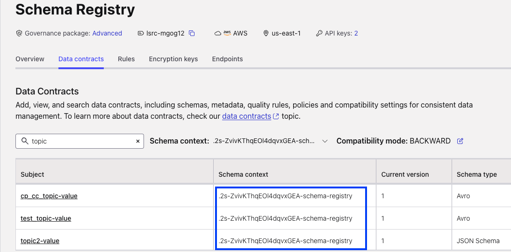

## Schema Exporter
## Content
- [CP Local to CC Schema Exporter](#CP-Local-to-CC-Schema-Exporter)
- [CC to CC Schema Exporter](#CC-to-CC-Schema-Exporter)
 
## CP Local to CC Schema Exporter
### Verify Schemas
```
[ubuntu@awst2x ~/customer/marchex]# curl -s http://localhost:8081/subjects
["cp_cc_topic-value","test_topic-value","topic2-value"]
```
### Start Exporter
#### Contexts
Ref:https://docs.confluent.io/platform/current/schema-registry/schema-linking-cp.html#configuration-options

#### context-type AUTO (default)

AUTO - Prepends the source context with an automatically generated context, which is .lsrc-xxxxxx for Confluent Cloud and alphanum cluster-id for CP. 
```
kafka-cluster cluster-id --bootstrap-server http://localhost:9092
Cluster ID: 2s-ZvivKThqEOl4dqvxGEA
```
```
[ubuntu@awst2x ~/customer/marchex]# schema-exporter --create --name cp-to-cloud-exporter --subjects ":*:"  --config-file exporter_config.txt --schema.registry.url http://localhost:8081
```
[]()

#### context-type DEFAULT
```
[ubuntu@awst2x ~/customer/marchex]# schema-exporter --create --name cp-to-cloud-exporter --subjects ":*:" --context-type "DEFAULT" --config-file exporter_config.txt --schema.registry.url http://localhost:8081
Successfully created exporter cp-to-cloud-exporter
```

### List running exporters
```
[ubuntu@awst2x ~/customer/marchex]# schema-exporter --list  --schema.registry.url http://localhost:8081
[cp-to-cloud-exporter]
```
#### Troubleshoot
If you get this error during create or list
```
io.confluent.kafka.schemaregistry.client.rest.exceptions.RestClientException: HTTP 404 Not Found; error code: 404
```
Update schema-registry.properties as below and restart

Ref: https://docs.confluent.io/platform/current/schema-registry/schema-linking-cp.html#configuration-snapshot-preview
```
[ubuntu@awst2x ~/confluent-7.7.1/etc/schema-registry]# tail -7 schema-registry.properties

#resource.extension.class=io.confluent.dekregistry.DekRegistryResourceExtension

#Added by Srinivas ( to enable schema linking ) - commented above
resource.extension.class=io.confluent.schema.exporter.SchemaExporterResourceExtension
kafkastore.update.handlers=io.confluent.schema.exporter.storage.SchemaExporterUpdateHandler
password.encoder.secret=mysecret
```

```
confluent local services restart
```

### Delete Exporter
```
> schema-exporter --delete  --name cp-to-cloud-expoter --schema.registry.url http://localhost:8081
io.confluent.kafka.schemaregistry.client.rest.exceptions.RestClientException: Exporter 'cp-to-cloud-expoter' must be paused first.; error code: 40963
```

### Pause Exporter
```
> schema-exporter --pause --name cp-to-cloud-expoter  --schema.registry.url http://localhost:8081
Successfully paused exporter marchex-exporter

> schema-exporter --delete  --name cp-to-cloud-expoter --schema.registry.url http://localhost:8081
Successfully deleted exporter cp-to-cloud-expoter
```
## CC to CC Schema Exporter
Exports all schemas from CUSTOM context to DEFAULT context
```
> confluent env list
  Current |     ID     |  Name   | Stream Governance Package
----------+------------+---------+----------------------------
          | env-yky2gk | Staging | ADVANCED
  *       | t966       | default | ESSENTIALS
> confluent env use env-yky2gk
Using environment "env-yky2gk".

> confluent schema-registry cluster describe
+--------------------------------+---------------------------------------------------------------------+
| Name                           | Always On Stream Governance                                         |
|                                | Package                                                             |
| Cluster                        | lsrc-y097r6                                                         |
| Endpoint URL                   | https://psrc-1ry6wml.us-east-1.aws.confluent.cloud                  |
| Private Endpoint URL           | https://lsrc-y097r6.us-east-1.aws.private.confluent.cloud           |
| Private Regional Endpoint URLs | us-east-1=https://lsrc-y097r6.us-east-1.aws.private.confluent.cloud |
| Catalog Endpoint URL           | https://psrc-1ry6wml.us-east-1.aws.confluent.cloud                  |
| Used Schemas                   | 659                                                                 |
| Available Schemas              | 19341                                                               |
| Free Schemas Limit             | 20000                                                               |
| Global Compatibility           | BACKWARD                                                            |
| Mode                           | IMPORT                                                              |
| Cloud                          | AWS                                                                 |
| Region                         | us-east-1                                                           |
| Package                        | ADVANCED                                                            |
+--------------------------------+---------------------------------------------------------------------+
```
```
> confluent schema-registry exporter  create cc-cc-exporter --subjects ":.lkc-4r001-schema-registry:*" --context-type DEFAULT --config exporter_config.txt
Created schema exporter "cc-cc-exporter".

confluent schema-registry exporter  describe cc-cc-exporter
+----------------+------------------------------------------------------------------------+
| Name           | cc-cc-exporter                                                         |
| Subjects       | :.lkc-4r001-schema-registry:*                                          |
| Subject Format | ${subject}                                                             |
| Context Type   | DEFAULT                                                                |
| Context        | .                                                                      |
| Config         | basic.auth.credentials.source=USER_INFO basic.auth.user.info=[hidden]  |
|                | schema.registry.url=https://psrc-1ry6wml.us-east-1.aws.confluent.cloud |
+----------------+------------------------------------------------------------------------+
```
