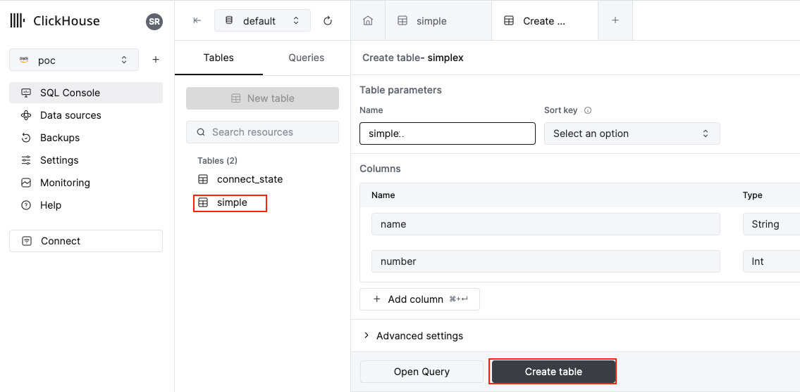
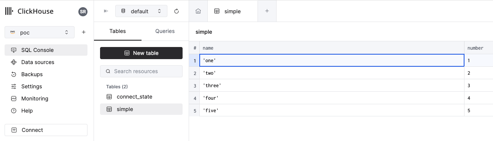

# ClickHouse Sink Connector for Confluent Platform
## Contents
- [Start Confluent Platform](#Start-Confluent-Platform)
- [Clickhouse Cloud](#Clickhouse-Cloud)
- [Deploy the connector](#Deploy-Clickhouse-Connector)
- [Produce to Topic](#Produce-to-Topic) 
- [Sink to Table](#Sink-to-Table)


### Reference
- [ClickHouse Sink connector](https://clickhouse.com/docs/en/integrations/kafka/clickhouse-kafka-connect-sink)

## Start Confluent Platform 
#### Local
```
> confluent local services start

Using CONFLUENT_CURRENT: /tmp/confluent.079104
Connect is [UP]
Control Center is [UP]
Kafka is [UP]
Kafka REST is [UP]
ksqlDB Server is [UP]
Schema Registry is [UP]
ZooKeeper is [UP]
```
#### Install clickhouse kafka connector plugin
> :information_source: Use **confluent-hub install clickhouse/clickhouse-kafka-connect:latest** for the latest version.
```
> confluent-hub install clickhouse/clickhouse-kafka-connect:v1.1.0
The component can be installed in any of the following Confluent Platform installations:
  1. /home/ubuntu/confluent-7.6.0 (based on $CONFLUENT_HOME)
  2. / (installed rpm/deb package)
  3. /home/ubuntu/confluent-7.6.0 (where this tool is installed)
Choose one of these to continue the installation (1-3): 1
Do you want to install this into /home/ubuntu/confluent-7.6.0/share/confluent-hub-components? (yN) y

  
Component's license:
Apache License, Version 2.0
http://www.apache.org/licenses/LICENSE-2.0
I agree to the software license agreement (yN) y
  
You are about to install 'clickhouse-kafka-connect' from ClickHouse Inc., as published on Confluent Hub.
Do you want to continue? (yN) y
      
Downloading component ClickHouse Connector for Apache Kafka v1.1.0, provided by ClickHouse Inc. from Confluent Hub and installing into /home/ubuntu/confluent-7.6.0/share/confluent-hub-components
Detected Worker's configs:
  1. Standard: /home/ubuntu/confluent-7.6.0/etc/kafka/connect-distributed.properties
  2. Standard: /home/ubuntu/confluent-7.6.0/etc/kafka/connect-standalone.properties
  3. Standard: /home/ubuntu/confluent-7.6.0/etc/schema-registry/connect-avro-distributed.properties
  4. Standard: /home/ubuntu/confluent-7.6.0/etc/schema-registry/connect-avro-standalone.properties 
Do you want to update all detected configs? (yN) y
  
Adding installation directory to plugin path in the following files:
  /home/ubuntu/confluent-7.6.0/etc/kafka/connect-distributed.properties
  /home/ubuntu/confluent-7.6.0/etc/kafka/connect-standalone.properties
  /home/ubuntu/confluent-7.6.0/etc/schema-registry/connect-avro-distributed.properties
  /home/ubuntu/confluent-7.6.0/etc/schema-registry/connect-avro-standalone.properties
    
Completed 

```


#### Validate the plugin is installed
```
> curl -sS localhost:8083/connector-plugins | jq '.[].class'  | grep click
"com.clickhouse.kafka.connect.ClickHouseSinkConnector"
```
> Restart confluent if not found 'confluent local services restart'

## Clickhouse Cloud

#### Subscribe for a 30 day Trial
> credentials: default / *********

> hostname: ngou9aj9le.us-east-1.aws.clickhouse.cloud

#### Validate connectivity 
```
> curl --user 'default:**********'   --data-binary 'SELECT 1'   https://ngou9aj9le.us-east-1.aws.clickhouse.cloud:8443
1
``` 
#### Create a table
[]()

## Deploy Clickhouse Connector
#### Deploy
```
> curl -X PUT -H "Content-Type: application/json" --url http://localhost:8083/connectors/ch_conn/config -d @clickhouse_string.json 
```
#### Check Status
```
> curl -X GET -H "Content-Type: application/json" --url http://localhost:8083/connectors/simple/status  | jq
{
  "name": "simple",
  "connector": {
    "state": "RUNNING",
    "worker_id": "172.31.14.247:8083"
  },
  "tasks": [
    {
      "id": 0,
      "state": "RUNNING",
      "worker_id": "172.31.14.247:8083"
    }
  ],
  "type": "sink"
}
```
## Produce to Topic
#### Create Topic
```
> kafka-topics --bootstrap-server localhost:9092 --create --topic simple   
Created topic simple.
```
#### Produce data to topic
```
> kafka-console-producer --broker-list localhost:9092 --topic  simple

>'one',1
>'two',2
>'three',3
>'four',4
>'five',5
```
## Sink to Table
#### Check the data is sinked to the table
[]()
