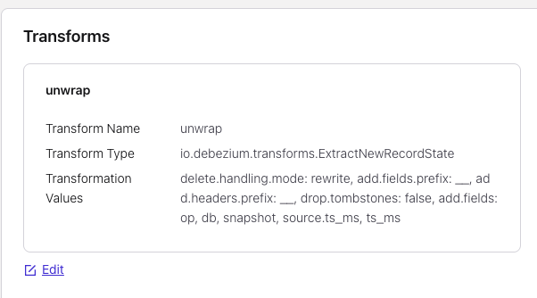
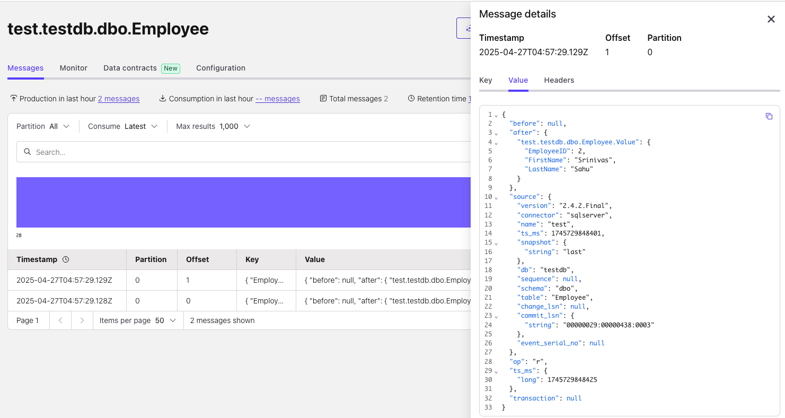
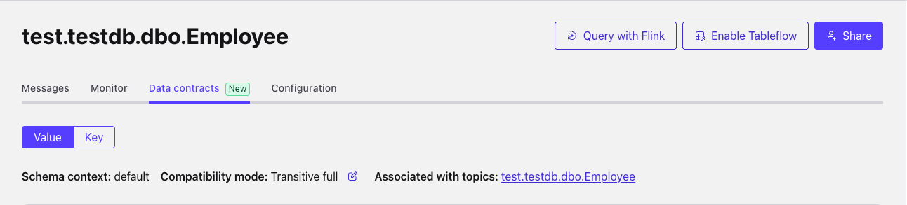
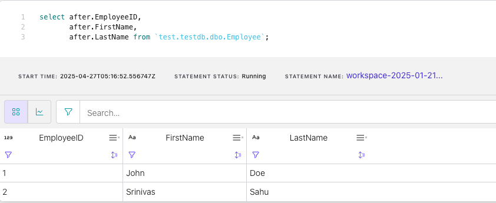
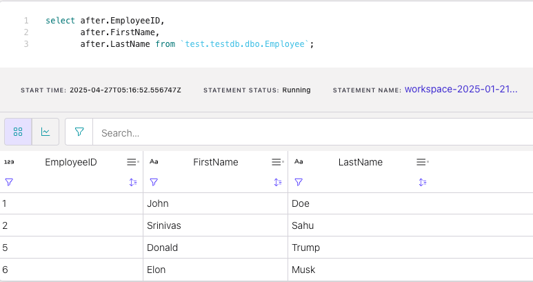
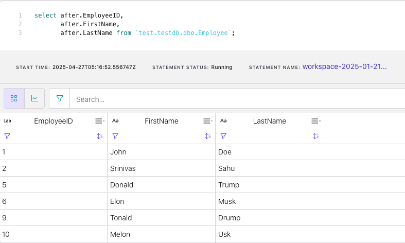
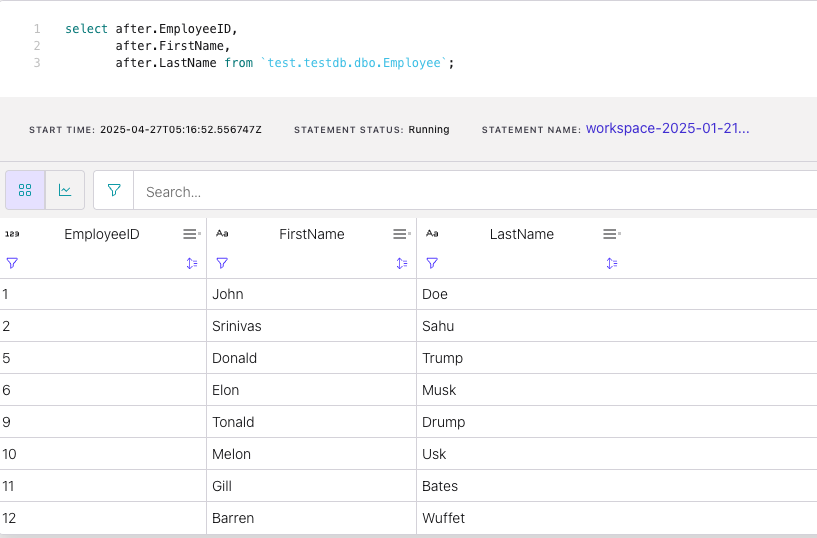
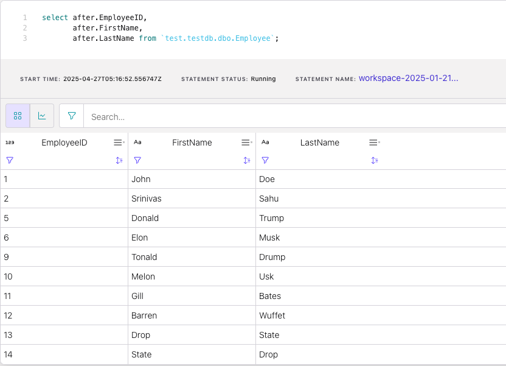

# Debezium MSSQL CDC Source Connector for Confluent Cloud
## Contents
- [Deploy MSSQL 2019 server in docker](#Deploy-mssql-2019-server-in-docker)
    - [Validate SQL Server Connectivity](#Validate-SQL-Server-Connectivity)
    - [SQL Server Initial Setup](#SQL-Server-Initial-Setup)
- [Deploy a Debezium CDC Connector in Confluent Cloud](#Deploy-a-Debezium-CDC-Connector-in-Confluent-Cloud)
    - [Check Status of the connector](#Check-Status-of-the-connector) 
- [Validate the topic and schema](#Validate-the-topic-and-schema)
    - [Change compatibility type to Full_transitive](#Change-compatibility-type-to-Full_Transitive)
- [Run a Flink SQL querying the table](#Run-a-Flink-SQL-querying-the-table)
- [Alter table](#Alter-table)
    - [Add a STRING column Addr NOT NULL](#Add-a-STRING-column-Addr-NOT-NULL)
    - [Add a STRING column State NULL](#Add-a-STRING-column-State-NOT-NULL)
    - [Add a INT column zipcode NULL](#Add-a-INT-column-zipcode-NULL)
    - [Drop a STRING column State NOT NULL](#Drop-a-STRING-column-State-NOT-NULL)
- [Final Version of the Schema](#Final-Version-of-the-Schema)
- [Troubleshoot](#Troubleshooting)
    - [CDC is not picking changes](#CDC-is-not-picking-changes)
- [Cleanup](#Cleanup)
  
### Prerequisites 
- Confluent cloud cluster with 3 pairs of Key & Secret for Cloud, Kafka & Schema Registry
- A host with a public IP accessible from Confluent Cloud e.g AWS EC2-
- SQLCMD Client - [Installation Instructions](https://learn.microsoft.com/en-us/sql/linux/sql-server-linux-setup-tools?view=sql-server-ver16&tabs=ubuntu-install#install-tools-on-linux)
- Setup a flink cluster to validate how debezium cdc connector schema evolution impacts Flink queries (optional )
- Configure the environment in env.cfg provided and Source it

## Deploy MSSQL 2019 server in docker
#### Start mssql
```
> docker-compose up -d
[+] Running 1/1
 ✔ Container mssql  Started                                                                                

> docker ps

CONTAINER ID   IMAGE                                        COMMAND                  CREATED          STATUS          PORTS                                       NAMES
b9b6fb71331b   mcr.microsoft.com/mssql/server:2019-latest   "/opt/mssql/bin/perm…"   32 minutes ago   Up 32 minutes   0.0.0.0:5434->1433/tcp, :::5434->1433/tcp   mssql
```

#### Validate SQL Server connectivty
Connect within the container 
```
> docker exec -it mssql bash
root@ce8e821050f4:/# /opt/mssql-tools18/bin/sqlcmd -S localhost -U SA -P "Srinivas@1" -C
psql (16.1 (Debian 16.1-1.pgdg120+1))
Type "help" for help.

1> select 'connected from pod'
2> go

------------------
connected from pod
```
Connect from localhost
```
> sqlcmd -S localhost,5434 -U SA -P "Srinivas@1" -C -Q "select 'connected'"

---------
connected

(1 rows affected)
```
Connect from internet ( Use DBVisualizer like tool on laptop )
```
Database Server: 18.220.31.188
Port           : 5434
Database       : testdb 
Database Userid: SA
Database Password: Srinivas@1
```
#### SQL Server Initial Setup
This setup Creates database testdb, table Employee, Enables CDC, Inserts two rows to Employee table 
```
> sqlcmd -S localhost,5434 -U SA -P "Srinivas@1" -C -i setup.sql
Changed database context to 'testdb'.
Job 'cdc.testdb_capture' started successfully.
Job 'cdc.testdb_cleanup' started successfully.
source_schema source_table capture_instance object_id   source_object_id start_lsn              end_lsn supports_net_changes has_drop_pending     role_name  index_name                     filegroup_name create_date             index_column_list captured_column_list
------------- ------------- --------------- ----------- ---------------- ---------------------- ------- -------------------- -------------------- ---------- ------------------------------ -------------- ----------------------- ----------------- ---------------------------------------------
dbo           Employee     dbo_Employee     965578478   581577110        0x0000002800000B380040 NULL    0                    NULL                 cdc_reader PK__Employee__7AD04FF15CA69CC1 NULL      
  2025-04-26 00:04:18.267 [EmployeeID]      [EmployeeID], [FirstName], [LastName]

(1 rows affected)
(1 rows affected)
```

Note: If you see this msg that means the SQLServerAgent is NOT RUNNING
`SQLServerAgent is not currently running so it cannot be notified of this action.`

```
> sqlcmd -S localhost,5434 -U SA -P "Srinivas@1" -C -i check_agent.sql
Current Service State
------------------------------------------------------------------------------------------------------------------------------------
Running.

(1 rows affected)
```

## Deploy a Debezium CDC Connector in Confluent Cloud
> :information_source: You need a Cloud scoped Key / Secret to run this API

Replace the following fields in the connector configuration before running this script
`name, database.hostname, kafka.endpoint, kafka.api.key, kafka.api.secret` to match your environment.
```
[ubuntu@awst2x ~/connectors/mssql]# ./deploy_connector.sh | jq
{
  "name": "xyz",
  "type": "source",
  "config": {
    "cloud.environment": "prod",
    "cloud.provider": "aws",
    "connector.class": "SqlServerCdcSourceV2",
    "database.hostname": "18.220.31.188",
    "database.names": "testdb",
    "database.password": "****************",
    "database.port": "5434",
    "database.user": "kafka",
    "kafka.api.key": "2XARONFFYJSKLTWF",
    "kafka.api.secret": "****************",
    "kafka.auth.mode": "KAFKA_API_KEY",
    "kafka.endpoint": "SASL_SSL://pkc-09zmdp.us-east-1.aws.confluent.cloud:9092",
    "kafka.region": "us-east-1",
    "name": "xyz",
    "output.data.format": "AVRO",
    "output.key.format": "JSON",
    "table.include.list": "dbo.Employee",
    "tasks.max": "1",
    "topic.prefix": "xyz"
  },
  "tasks": []
}                                                                                                                                       
```
> :information_source: Table include list should be schemaname.tablename
#### Check Status of the connector
```
> curl --request GET --url "https://api.confluent.cloud/connect/v1/environments/${ENV_ID}/clusters/${CLUSTER_ID}/connectors/${CONNECTOR_NAME}/status" --header 'Authorization: Basic '$CLOUD_AUTH'' | jq
 
{
  "name": "sql_deb_cdc",
  "connector": {
    "state": "RUNNING",
    "worker_id": "sql_deb_cdc",
    "trace": ""
  },
  "tasks": [
    {
      "id": 0,
      "state": "RUNNING",
      "worker_id": "sql_deb_cdc",
      "msg": ""
    }
  ],
  "type": "source",
  "errors_from_trace": [],
  "validation_errors": [],
  "override_message": "",
  "validation_error_category_info": null,
  "is_csfle_error": false,
  "error_details": null
}
```

#### CDC Connector transformations
> :information_source: FYI this unwrap SMT will result in a unwrapped schema  
[]()

## Validate the topic and schema
[]()

#### Change compatibility type to Full_Transitive
[]()

<details>
  <summary>Schema V1</summary>
  
  ```js 
{
  "connect.name": "test.testdb.dbo.Employee.Envelope",
  "connect.version": 1,
  "fields": [
    {
      "default": null,
      "name": "before",
      "type": [
        "null",
        {
          "connect.name": "test.testdb.dbo.Employee.Value",
          "fields": [
            {
              "name": "EmployeeID",
              "type": "int"
            },
            {
              "name": "FirstName",
              "type": "string"
            },
            {
              "name": "LastName",
              "type": "string"
            }
          ],
          "name": "Value",
          "type": "record"
        }
      ]
    },
    {
      "default": null,
      "name": "after",
      "type": [
        "null",
        "Value"
      ]
    },
    {
      "name": "source",
      "type": {
        "connect.name": "io.debezium.connector.v2.sqlserver.Source",
        "fields": [
          {
            "name": "version",
            "type": "string"
          },
          {
            "name": "connector",
            "type": "string"
          },
          {
            "name": "name",
            "type": "string"
          },
          {
            "name": "ts_ms",
            "type": "long"
          },
          {
            "default": "false",
            "name": "snapshot",
            "type": [
              {
                "connect.default": "false",
                "connect.name": "io.debezium.data.Enum",
                "connect.parameters": {
                  "allowed": "true,last,false,incremental"
                },
                "connect.version": 1,
                "type": "string"
              },
              "null"
            ]
          },
          {
            "name": "db",
            "type": "string"
          },
          {
            "default": null,
            "name": "sequence",
            "type": [
              "null",
              "string"
            ]
          },
          {
            "name": "schema",
            "type": "string"
          },
          {
            "name": "table",
            "type": "string"
          },
          {
            "default": null,
            "name": "change_lsn",
            "type": [
              "null",
              "string"
            ]
          },
          {
            "default": null,
            "name": "commit_lsn",
            "type": [
              "null",
              "string"
            ]
          },
          {
            "default": null,
            "name": "event_serial_no",
            "type": [
              "null",
              "long"
            ]
          }
        ],
        "name": "Source",
        "namespace": "io.debezium.connector.v2.sqlserver",
        "type": "record"
      }
    },
    {
      "name": "op",
      "type": "string"
    },
    {
      "default": null,
      "name": "ts_ms",
      "type": [
        "null",
        "long"
      ]
    },
    {
      "default": null,
      "name": "transaction",
      "type": [
        "null",
        {
          "connect.name": "event.block",
          "connect.version": 1,
          "fields": [
            {
              "name": "id",
              "type": "string"
            },
            {
              "name": "total_order",
              "type": "long"
            },
            {
              "name": "data_collection_order",
              "type": "long"
            }
          ],
          "name": "block",
          "namespace": "event",
          "type": "record"
        }
      ]
    }
  ],
  "name": "Envelope",
  "namespace": "test.testdb.dbo.Employee",
  "type": "record"
}
```
</details>

## Run a Flink SQL querying the table 
[]()

## Alter table
#### Add a string column Addr NOT NULL
 
> Expectation: Since the Debezium connector is configured for an Envelope schema ( before, after )  
> - The connector should successfully register the schema V2
> - The FLINK DML should not fail, but it will not see the Addr attribute

:information_source: This .sql Adds a STRING NOT NULL column Addr and inserts two rows with EployeeID 5, 6
```
> sqlcmd -S localhost,5434 -U SA -P "Srinivas@1" -C -i alter_add_addr_notnull.sql
Changed database context to 'testdb'.
source_schema source_table capture_instance object_id   source_object_id start_lsn              end_lsn supports_net_changes has_drop_pending     role_name  index_name                     filegroup_name create_date             index_column_list captured_column_list
------------- ------------- --------------- ----------- ---------------- ---------------------- ------- -------------------- -------------------- ---------- ------------------------------ -------------- ----------------------- ----------------- ---------------------------------------------
dbo           Employee      dbo_Employee    1061578820  581577110        0x0000002C00000DD00043 NULL    0                    NULL                 cdc_reader PK__Employee__7AD04FF15CA69CC1 NULL           2025-04-26 02:19:18.260 [EmployeeID]      [EmployeeID], [FirstName], [LastName], [Addr]

(1 rows affected)
(1 rows affected)
```
#### Running Flink Query
[]()


#### Add a string column State NOT NULL

> Expectation: Since the Debezium connector is configured for an Envelope schema ( before, after )  
> - The connector should successfully register the schema V3
> - The FLINK DML should not fail, but it will not see the State attribute

:information_source: This .sql Adds a STRING NOT NULL column State and inserts two rows with EployeeID 9, 10

```
> sqlcmd -S localhost,5434 -U SA -P "Srinivas@1" -C -i alter_add_state_notnull.sql
Changed database context to 'testdb'.
Msg 2705, Level 16, State 4, Server cc5fb552ac0c, Line 1
source_schema source_table capture_instance object_id   source_object_id start_lsn              end_lsn supports_net_changes has_drop_pending     role_name  index_name                     filegroup_name create_date             index_column_list captured_column_list
------------- ------------- --------------- ----------- ---------------- ---------------------- ------- -------------------- -------------------- ---------- ------------------------------ -------------- ----------------------- ----------------- ---------------------------------------------
dbo           Employee     dbo_Employee     1157579162  581577110        0x0000002C0000215000AF NULL    0                    NULL                 cdc_reader PK__Employee__7AD04FF15CA69CC1 NULL              2025-04-26 02:25:05.750 [EmployeeID]   [EmployeeID], [FirstName], [LastName], [Addr], [State]

(1 rows affected)
(1 rows affected)
```
#### Running Flink Query
[]()

#### Add a int column zipcode NULL

> Expectation: Since the Debezium connector is configured for an Envelope schema ( before, after )  
> - The connector should successfully register the V4 schema with a new INT attribute zipcode
> - The FLINK DML should not fail, but it will not see the zipcode attribute

:information_source: This .sql Adds a INTEGER NULLABLE column zipcode and inserts two rows with EployeeID 11, 12

```
> sqlcmd -S localhost,5434 -U SA -P "Srinivas@1" -C -i alter_add_zipcode_null.sql
Changed database context to 'testdb'.
source_schema source_table capture_instance object_id   source_object_id start_lsn              end_lsn supports_net_changes has_drop_pending     role_name  index_name                     filegroup_name create_date             index_column_list captured_column_list
------------- ------------- --------------- ----------- ---------------- ---------------------- ------- -------------------- -------------------- ---------- ------------------------------ -------------- ----------------------- ----------------- ---------------------------------------------
dbo           Employee     dbo_Employee     1237579447  581577110        0x0000002C000033B0005B NULL    0                    NULL                 cdc_reader PK__Employee__7AD04FF15CA69CC1 NULL           2025-04-26 02:28:18.753 [EmployeeID]      [EmployeeID], [FirstName], [LastName], [Addr], [State], [zipcode]

(1 rows affected)
(1 rows affected)
```
#### Running Flink Query
[]()

#### Drop a string column State NOT NULL 
> Expectation: Since the Debezium connector is configured for an Envelope schema ( before, after )  
> - The connector should successfully register the V5 schema dropping attribute State
> - The FLINK DML should not fail 

:information_source: This .sql Drops a NOT NULL column State and inserts two rows with EployeeID 13, 14
```
> sqlcmd -S localhost,5434 -U SA -P "Srinivas@1" -C -i alter_drop_state_notnull.sql
Changed database context to 'testdb'.
source_schema source_table capture_instance object_id   source_object_id start_lsn              end_lsn supports_net_changes has_drop_pending     role_name  index_name                     filegroup_name create_date             index_column_list captured_column_list
------------- ------------- --------------- ----------- ---------------- ---------------------- ------- -------------------- -------------------- ---------- ------------------------------ -------------- ----------------------- ----------------- ---------------------------------------------
dbo           Employee      dbo_Employee    1317579732  581577110        0x0000002C000047480049 NULL    0                    NULL                 cdc_reader PK__Employee__7AD04FF15CA69CC1 NULL           2025-04-26 02:34:04.610 [EmployeeID]      [EmployeeID], [FirstName], [LastName], [Addr], [zipcode]

(1 rows affected)
(1 rows affected)
```
#### Running Flink Query
[]()

## Final Version of the Schema
- V1 - Initial setup - Columns : EmployeeID, FirstName, LastName
- V2 - Add Addr      - Columns : EmployeeID, FirstName, LastName, Addr
- V3 - Add State     - Columns : EmployeeID, FirstName, LastName, Addr, State
- V4 - Add Zipcode   - Columns : EmployeeID, FirstName, LastName, Addr, State, Zipcode
- V5 - Drop State    - Columns : EmployeeID, FirstName, LastName, Addr , Zipcode
<details>
  <summary>Schema V5</summary>
  
  ```js
{
  "connect.name": "test.testdb.dbo.Employee.Envelope",
  "connect.version": 1,
  "fields": [
    {
      "default": null,
      "name": "before",
      "type": [
        "null",
        {
          "connect.name": "test.testdb.dbo.Employee.Value",
          "fields": [
            {
              "name": "EmployeeID",
              "type": "int"
            },
            {
              "name": "FirstName",
              "type": "string"
            },
            {
              "name": "LastName",
              "type": "string"
            },
            {
              "default": "defval",
              "name": "Addr",
              "type": {
                "connect.default": "defval",
                "type": "string"
              }
            },
            {
              "default": null,
              "name": "zipcode",
              "type": [
                "null",
                "int"
              ]
            }
          ],
          "name": "Value",
          "type": "record"
        }
      ]
    },
    {
      "default": null,
      "name": "after",
      "type": [
        "null",
        "Value"
      ]
    },
    {
      "name": "source",
      "type": {
        "connect.name": "io.debezium.connector.v2.sqlserver.Source",
        "fields": [
          {
            "name": "version",
            "type": "string"
          },
          {
            "name": "connector",
            "type": "string"
          },
          {
            "name": "name",
            "type": "string"
          },
          {
            "name": "ts_ms",
            "type": "long"
          },
          {
            "default": "false",
            "name": "snapshot",
            "type": [
              {
                "connect.default": "false",
                "connect.name": "io.debezium.data.Enum",
                "connect.parameters": {
                  "allowed": "true,last,false,incremental"
                },
                "connect.version": 1,
                "type": "string"
              },
              "null"
            ]
          },
          {
            "name": "db",
            "type": "string"
          },
          {
            "default": null,
            "name": "sequence",
            "type": [
              "null",
              "string"
            ]
          },
          {
            "name": "schema",
            "type": "string"
          },
          {
            "name": "table",
            "type": "string"
          },
          {
            "default": null,
            "name": "change_lsn",
            "type": [
              "null",
              "string"
            ]
          },
          {
            "default": null,
            "name": "commit_lsn",
            "type": [
              "null",
              "string"
            ]
          },
          {
            "default": null,
            "name": "event_serial_no",
            "type": [
              "null",
              "long"
            ]
          }
        ],
        "name": "Source",
        "namespace": "io.debezium.connector.v2.sqlserver",
        "type": "record"
      }
    },
    {
      "name": "op",
      "type": "string"
    },
    {
      "default": null,
      "name": "ts_ms",
      "type": [
        "null",
        "long"
      ]
    },
    {
      "default": null,
      "name": "transaction",
      "type": [
        "null",
        {
          "connect.name": "event.block",
          "connect.version": 1,
          "fields": [
            {
              "name": "id",
              "type": "string"
            },
            {
              "name": "total_order",
              "type": "long"
            },
            {
              "name": "data_collection_order",
              "type": "long"
            }
          ],
          "name": "block",
          "namespace": "event",
          "type": "record"
        }
      ]
    }
  ],
  "name": "Envelope",
  "namespace": "test.testdb.dbo.Employee",
  "type": "record"
}
```
</details>

## Troubleshoot 
#### CDC is not picking changes

Make sure the SQL Server Agent is running. If it is stopped it may not pick the changes to the table. 
 
```
> sqlcmd -S localhost,5434 -U SA -P "Srinivas@1" -C -i check_agent.sql
Current Service State
----------------------
Running.

(1 rows affected)
```

## Cleanup
Needs Kafka Key/Secret & SchemaRegistry Key/Secret
```
> ./cleanup.sh ss.testdb.dbo.Employee
=== Shutting down Docker

[+] Stopping 1/1
 ✔ Container mssql  Stopped                                                                               0.7s

? Going to remove mssql Yes
[+] Removing 1/0
 ✔ Container mssql  Removed

WARNING! This will remove anonymous local volumes not used by at least one container.
Are you sure you want to continue? [y/N] y
Total reclaimed space: 0B

=== Deleting topic
Are you sure you want to delete topic "ss.testdb.dbo.Employee"? (y/n): y
Deleted topic "ss.testdb.dbo.Employee".

=== Hard Deleting Topic Schemas for Key  
{"error_code":40401,"message":"Subject 'ss.testdb.dbo.Employee-key' not found."}
{"error_code":40401,"message":"Subject 'ss.testdb.dbo.Employee-key' not found."}

=== Hard Deleting Topic Schemas for Value
[1,2,3,4,5][1,2,3,4,5]
```
