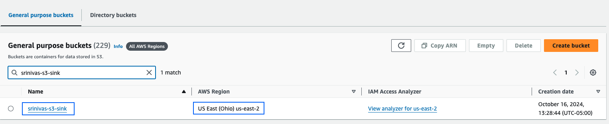
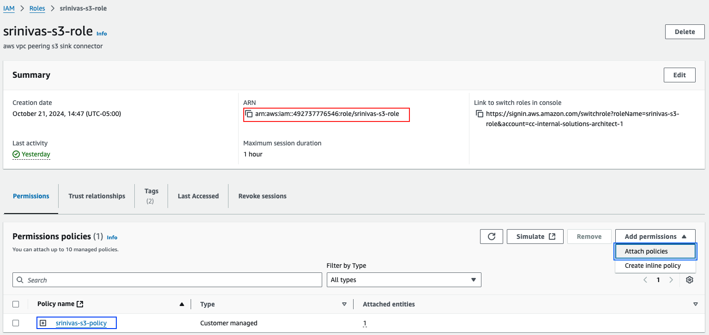
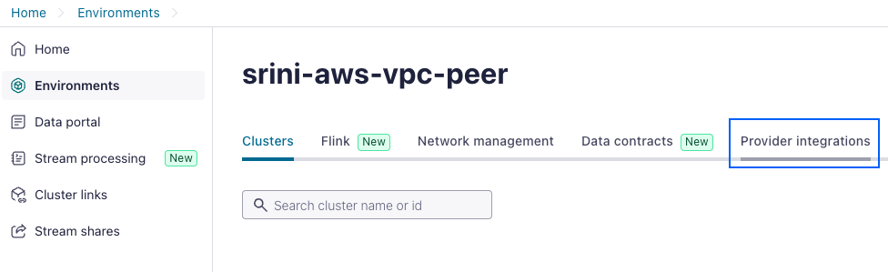
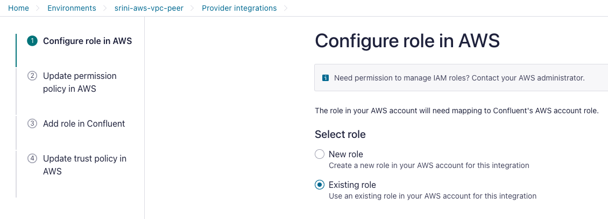
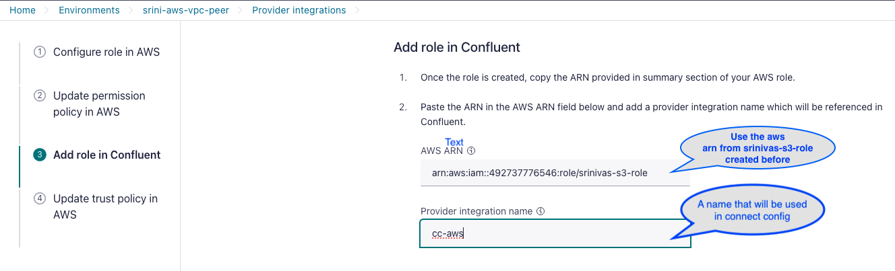
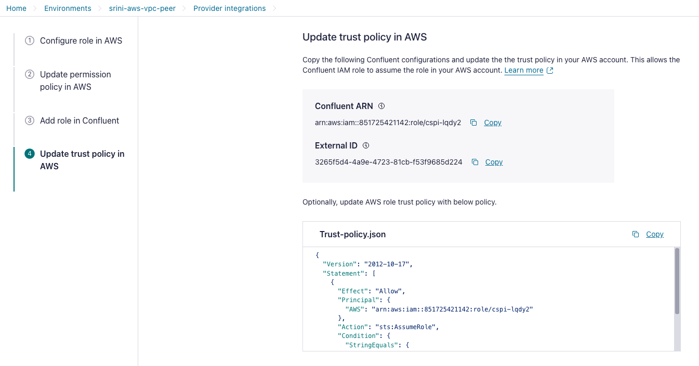
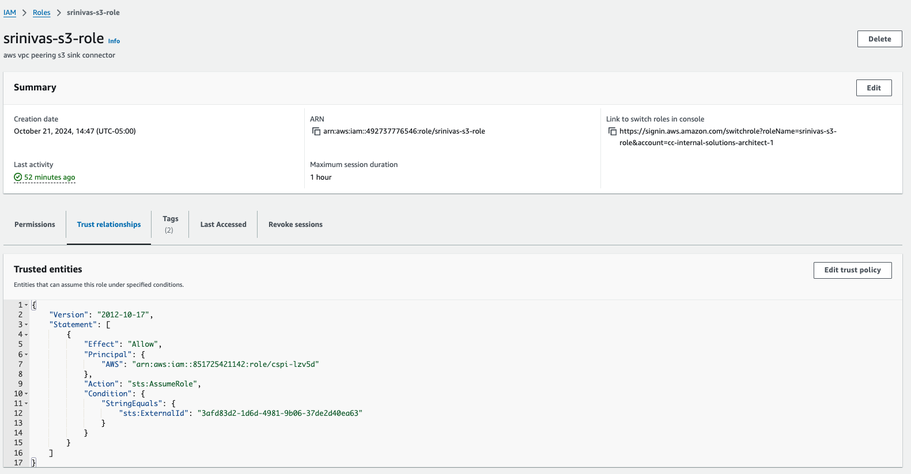
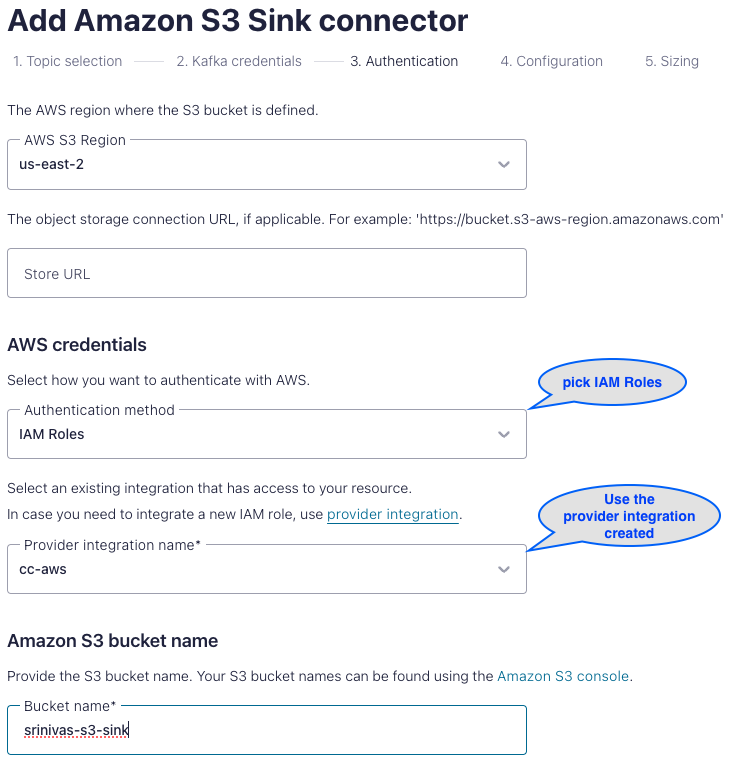
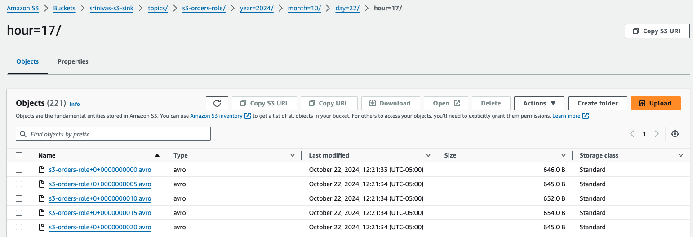

# AWS S3 Sink Connector for Confluent Cloud

S3 Sink Connector in Confluent Cloud VPC-Peered with Customer VPC.
You have two options for Authorization
1) IAMRole    - Attach IAMPolicy to the IAMRole and update the TrustedRelationship from the policy obtained on ProviderIntegration
2) AccessKeys - Attach IAMPolicy to the IAMUser and use AWS Access Keys

:warning: If you chose the AccessKeys method, Make sure the IAMUser is not the federated user like nonprod_administrator.

Below steps are for the IAMRole option and assumes Confluent Cloud cluster & VPC-Peering are provisioned, preferably with Terraform.

### Reference Docs
Please read the reference docs first to understand the flow
- [S3 Sink connector](https://docs.confluent.io/cloud/current/connectors/cc-s3-sink/cc-s3-sink.html)
- [S3 AWS IAM Roles](https://docs.confluent.io/cloud/current/connectors/provider-integration/index.html)
- [Security with IAM Roles in Confluent Managed Connectors](https://www.confluent.io/blog/enhancing-security-with-iam-roles-in-confluent-managed-connectors/)
  
## Contents
- [Create S3 Bucket in AWS ](#Create-S3-Bucket-ion-AWS)
- [Create S3 Bucket Policy in AWS ](#Create-S3-Bucket-Policy-in-AWS)
- [Create IAM Policy in AWS ](#Create-IAM-Policy-in-AWS)
- [Create IAM Role in AWS ](#Create-IAM-Role-in-AWS)
- [Configure Provider Integration in CC](#Configure-Provider-Integration-in-CC)
- [Provision the S3 Sink Connector](#Provision-the-S3-Sink-Connector)
- [Produce to Topic](#Produce-to-Topic) 
- [Sink to S3 Bucket](#Sink-to-S3-Bucket)


## Create S3 Bucket in AWS
> Chose the region appropriately  ( preferably in the same region as CC connect cluster )

[]()

## Create S3 Bucket Policy in AWS
> :information_source: Go to Amazon S3 > Buckets > srinivas-s3-sink | Permissions tab

> 457492987184 - Confluent Cloud Cluster AWS Account ID ( Found in cluster network settings )

> srinivas-s3-sink - AWS S3 Bucket created in previous step

```
{
    "Version": "2012-10-17",
    "Statement": [
        {
            "Sid": "PolicyForAllowUploadWithACL",
            "Effect": "Allow",
            "Principal": {
                "AWS": "arn:aws:iam::457492987184:root"
            },
            "Action": "s3:*",
            "Resource": [
                "arn:aws:s3:::srinivas-s3-sink",
                "arn:aws:s3:::srinivas-s3-sink/*"
            ]
        }
    ]
}
```
If you prefer to restrict the S3 bucket just to confluent cloud and access from AWS Console
Add this section to the above bucket policy in the Statement part of the json element
> :information_source: vpc-05f644c9478799cf3 - Confluent Cloud VPC,  vpc-0589c84872db4447f - Destination VPC ( AWS )

```
        {
    		"Sid": "Access-to-specific-VPC-only",
    		"Principal": "*",
    		"Action": "s3:*",
    		"Effect": "Deny",
    		"Resource": ["arn:aws:s3:::srinivas-s3-sink",
                 "arn:aws:s3:::srinivas-s3-sink/*"],
    		"Condition": {
      		"StringNotEquals": {
        		"aws:SourceVpc": ["vpc-05f644c9478799cf3", "vpc-0589c84872db4447f"]
      			}
    		}
        }
```
## Create IAM Policy in AWS
> :information_source: Go to Amazon IAM > Policies  | Create policy

> Select a service > S3

> Set permissions by selecting the JSON Tab and paste the below Allow permisions on the srinivas-s3-sink bucket created in the previous step
 
```
{
    "Version": "2012-10-17",
    "Statement": [
        {
            "Effect": "Allow",
            "Action": [
                "s3:ListAllMyBuckets"
            ],
            "Resource": "arn:aws:s3:::*"
        },
        {
            "Effect": "Allow",
            "Action": [
                "s3:ListBucket",
                "s3:GetBucketLocation",
                "s3:ListBucketMultipartUploads"
            ],
            "Resource": "arn:aws:s3:::srinivas-s3-sink"
        },
        {
            "Effect": "Allow",
            "Action": [
                "s3:PutObject",
                "s3:PutObjectTagging",
                "s3:GetObject",
                "s3:AbortMultipartUpload",
                "s3:ListMultipartUploadParts"
            ],
            "Resource": "arn:aws:s3:::srinivas-s3-sink/*"
        }
    ]
}
```
Note: Name of the above policy is srinivas-s3-policy

## Create IAM Role in AWS

Create a Role with Trusted entity type of AWS account and Add permissions by attaching policy created above

[]()

## Configure Provider Integration in CC
#### In Confluent Cloud UI goto Environments and click on Provider Integrations
[]()

#### Configure role in AWS
[]()


#### Update permission policy in AWS 
- This is already done as part of IAM Policy created in AWS few steps above.

#### Add role in Confluent
- Populate the AWS ARN from the IAM Role created in AWS few steps above
[]()

#### Update IAM Role Trusted Policy
Copy the Trust-policy.json configuration from IdentityProvider configuration
[]()
and update the TrustedRelationship tab in IAMRole created above in AWS account. 
This allows the Confluent IAM role to assume the role in your AWS account.
[]()

## Provision the S3 Sink Connector 
There are two options
- Using IAM Role ( THe above steps are for this option )
- Using Access Keys
-- You need a IAMUser Access keys
-- In the IAMUser addpermissions attach the UserCreated IAMPolicy or AWSManaged S3Policy
  
[]()

## Produce to Topic
#### Create Topic
```
[ubuntu@awst2x ~]# confluent kafka topic create s3-orders-role --partitions 1
Created topic "s3-orders-role".
```
#### Produce data to topic
- Manual
```
[ubuntu@awst2x ~/customer/epic/cc/vpc-peer]# kafka-avro-console-producer --bootstrap-server pkc-zgnq6y.us-east-2.aws.confluent.cloud:9092 --topic s3-sink-test --producer.config java.config  --property basic.auth.credentials.source="USER_INFO" --property value.schema='{"type":"record","name":"myrecord","fields":[{"name":"name","type":"string"}, {"name":"price","type":"float"}, {"name":"quantity","type":"int"}]}' --property schema.registry.url="https://psrc-em25q.us-east-2.aws.confluent.cloud"  --property schema.registry.basic.auth.user.info="XXXXXXXXX:XXXXXXXXXXXXXXXXXXXX"

{"name": "shoes", "price": 72.00, "quantity": 20}
{"name": "hats", "price": 12.00, "quantity": 3}
{"name": "shirts", "price": 22.00, "quantity": 2}
^C
```
OR

- Start a Datagen Connector

## Sink to S3 Bucket
#### Check the data is sinked to the S3 bucket srinivas-s3-sink
[]()
