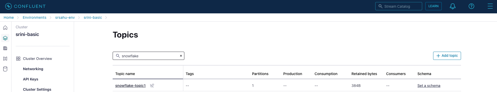
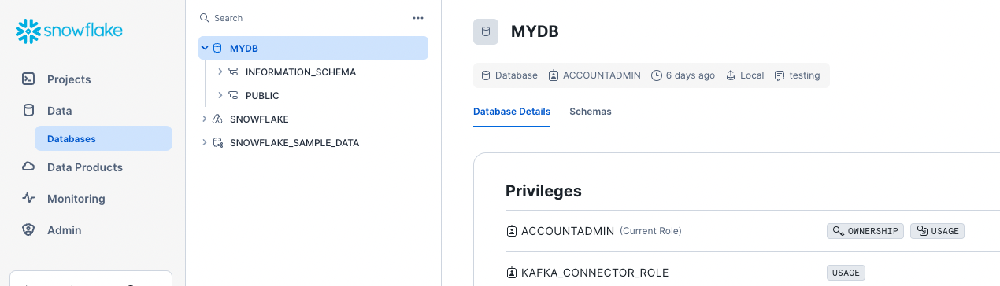
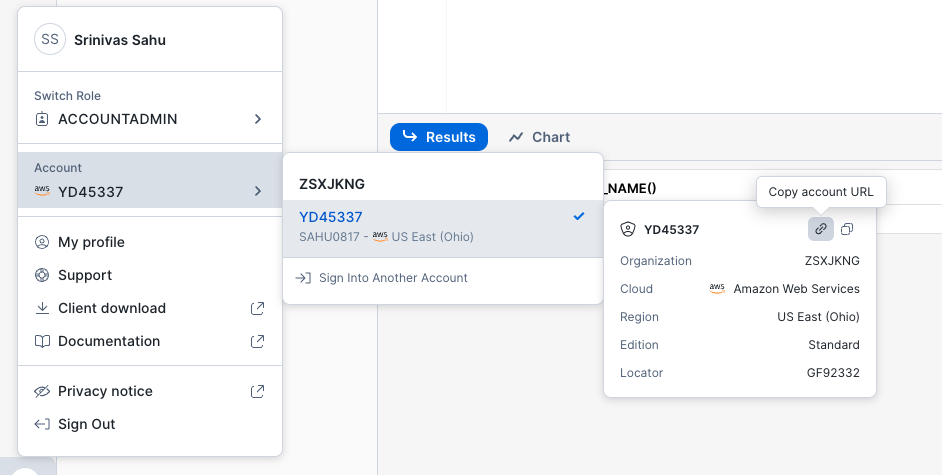
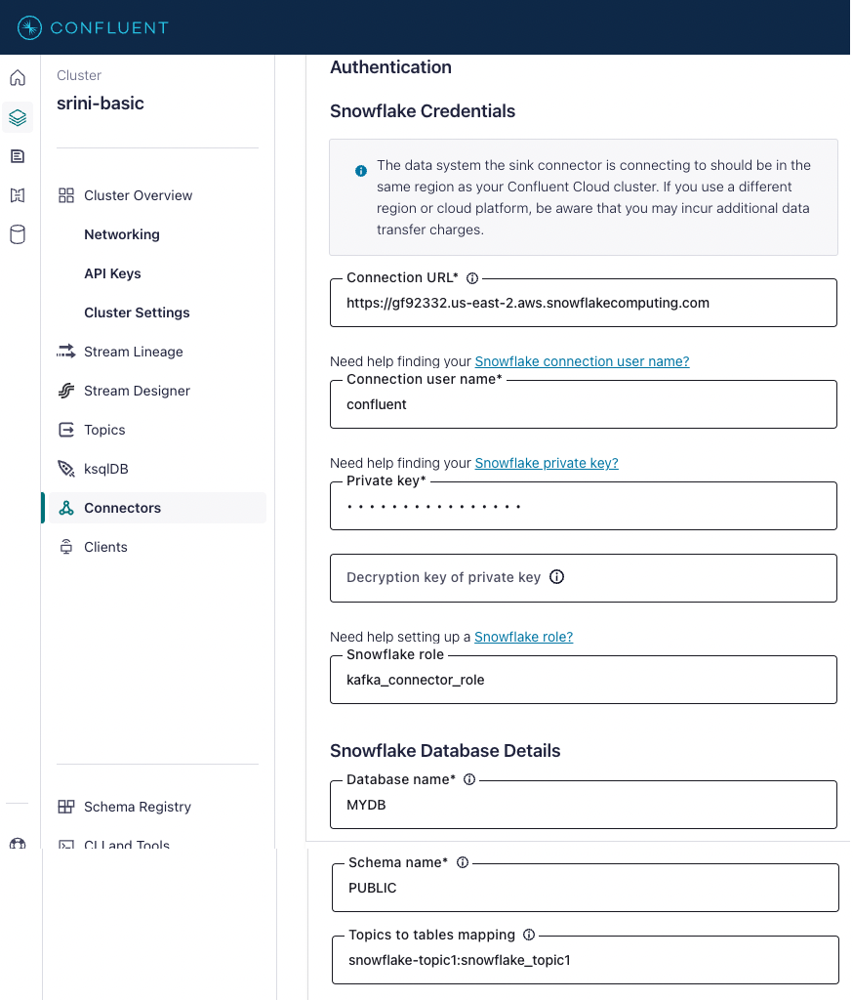
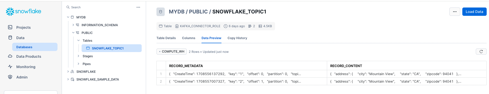

# Snowflake Sink Connector in Confluent Cloud
## Contents
- [Generate Keys](#Generate-Keys)
- [Create topic in Confluent Cloud](#Create-topic-in-Confluent-Cloud)
- [Create User, Roles, DB, Schema in Snowflake](#Create-User,-Roles,-DB,-Schema-in-Snowflake)
- [Configure snowflake connector in Confluent Cloud](#Configure-snowflake-connector-in-Confluent-Cloud)
- [Verify the connector sinking to snowflake](#Verify-the-connector-sinking-to-snowflake) 

## Generate Keys
#### Generate the private key
```
> openssl genrsa -out snowflake_key.pem 2048
Generating RSA private key, 2048 bit long modulus (2 primes)
.......................+++++
................................+++++
e is 65537 (0x010001)
```
#### Generate the public key
```
> openssl rsa -in snowflake_key.pem  -pubout -out snowflake_key.pub
writing RSA key
```
#### Extract the Private & Public Keys.
```
> ls -ltr
-rw------- 1 ubuntu ubuntu 1679 Feb 21 18:44 snowflake_key.pem
-rw-rw-r-- 1 ubuntu ubuntu  451 Feb 21 18:45 snowflake_key.pub

> grep -v "BEGIN PUBLIC" snowflake_key.pub | grep -v "END PUBLIC"|tr -d '\r\n' > public_key
> grep -v "BEGIN RSA PRIVATE KEY" snowflake_key.pem | grep -v "END RSA PRIVATE KEY"|tr -d '\r\n' > private_key
```

## Create topic in Confluent Cloud
```
snowflake-topic1
```
[]()

## Create User, Roles, DB, Schema in Snowflake

```
CREATE USER confluent RSA_PUBLIC_KEY='<public-key>';
GRANT ROLE SYSADMIN to user confluent;
```
```
// Use a role that can create and manage roles and privileges:
use role securityadmin;

// Create a Snowflake role with the privileges to work with the connector
create role kafka_connector_role;

// Grant privileges on the database:
grant usage on database MYDB to role kafka_connector_role;

// Grant privileges on the schema:
grant usage on schema MYDB.PUBLIC to role kafka_connector_role;
grant create table on schema MYDB.PUBLIC to role kafka_connector_role;
grant create stage on schema MYDB.PUBLIC to role kafka_connector_role;
grant create pipe on schema MYDB.PUBLIC to role kafka_connector_role;

// Grant the custom role to an existing user:
grant role kafka_connector_role to user confluent;

// Make the new role the default role:
alter user confluent set default_role=kafka_connector_role;

```
[]()

## Configure snowflake connector in Confluent Cloud

#### Snowflake Connection URL
[]()


#### Connector configuration
[]()


```
{
  "topics": "snowflake-topic1",
  "schema.context.name": "default",
  "input.data.format": "JSON",
  "input.key.format": "STRING",
  "connector.class": "SnowflakeSink",
  "name": "SnowflakeSinkConnector_1",
  "kafka.auth.mode": "KAFKA_API_KEY",
  "kafka.api.key": "2R2OAUKUBRNUPRJ4",
  "kafka.api.secret": "*****************",
  "snowflake.url.name": "https://gf92332.us-east-2.snowflakecomputing.com:443",
  "snowflake.user.name": "confluent",                                 ← snowflake db user 
  "snowflake.private.key": "**********",
  "snowflake.role.name": "kafka_connector_role",              ← snowflake db user role with privileges/grants on MYDB.PUBLIC 
  "snowflake.database.name": "MYDB",
  "snowflake.schema.name": "PUBLIC",
  "snowflake.topic2table.map": "snowflake-topic1:snowflake_topic1",   ← No hyphens in tablename
  "snowflake.ingestion.method": "SNOWPIPE",
  "snowflake.metadata.createtime": "true",
  "snowflake.metadata.topic": "true",
  "snowflake.metadata.offset.and.partition": "true",
  "snowflake.metadata.all": "true",
  "snowflake.enable.schematization": "false",
  "buffer.flush.time": "120",
  "buffer.count.records": "10000",
  "buffer.size.bytes": "10000000",
  "errors.tolerance": "all",
  "key.subject.name.strategy": "TopicNameStrategy",
  "value.subject.name.strategy": "TopicNameStrategy",
  "max.poll.interval.ms": "300000",
  "max.poll.records": "500",
  "tasks.max": "1"
}
```
## Verify the connector sinking to snowflake
[]()

