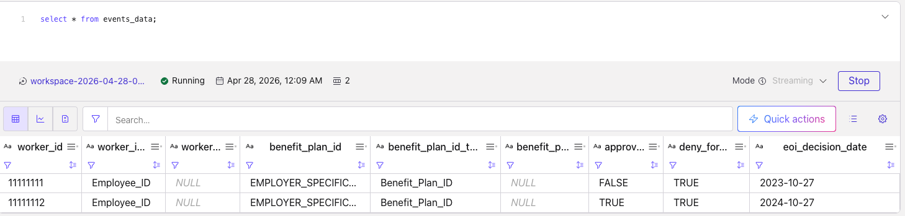
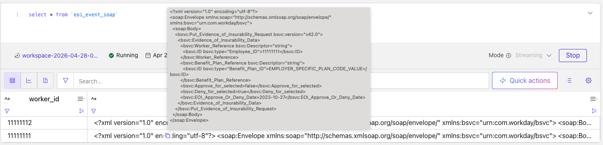

# Flink Java UDF: JSON → SOAP XML

This guide walks through building and operating a **Flink SQL scalar UDF** in Java that accepts a **JSON string**  and returns a **SOAP 1.1 XML string** envelope).


The module uses **Jackson** to parse JSON, **JDOM2** to build namespaced SOAP XML, **`ScalarFunction`** for Flink SQL, and a  **`exec-maven-plugin`** entry point for local checks without a cluster.

## Contents

- [What you are building](#what-you-are-building)
- [Prerequisites](#prerequisites)
- [1. Implement and unit-test locally](#1-implement-and-unit-test-locally)
- [2. Build the JAR you will upload to Flink](#2-build-the-jar-you-will-upload-to-flink)
- [3. Manual check without Flink (Maven)](#3-manual-check-without-flink-maven)
- [4. Manual check using only the shaded JAR](#4-manual-check-using-only-the-shaded-jar)
- [5. Register the JAR on Confluent Cloud Flink](#5-register-the-jar-on-confluent-cloud-flink)
- [6. Create the SQL function in Flink](#6-create-the-sql-function-in-flink)
- [7. Create a topic & schema that matches this payload](#topic-schema-payload)
- [8. Call the UDF from SQL](#8-call-the-udf-from-sql)
  - [Verify the inferred Flink table from the `events_data` input topic](#verify-events-data-table)
  - [Create a output table](#eoi-output-sink-table)
  - [Run the Flink job to read the events from the input topic and use UDF](#eoi-udf-insert-job)
  - [Validate the output](#eoi-validate-query)
- [Reference samples](#reference-samples)
- [See also](#see-also)


---

## What you are building

| Piece | Role |
|--------|------|
| POJO + Jackson | Map JSON fields to a Java model. |
| XML builder (e.g. JDOM2) | Emit SOAP `Envelope` / `Body` and business payload with correct `xmlns` / prefixes. |
| `ScalarFunction` | Expose `eval(String json)` (and optional overloads) to Flink SQL. |
| Shaded JAR | Bundle Jackson and JDOM2; keep **Flink APIs as `provided`** so they are not duplicated inside the fat JAR. |
| Tests | Lock behavior against a sample JSON file and expected XML fragments. |

---

## Prerequisites

- **JDK 11+** and **Maven 3.6+**
- For Confluent Cloud Flink: **Confluent CLI** logged in, plus your **cloud**, **region**, **environment**, and **compute pool** identifiers

---

## 1. Implement and unit-test locally

From the UDF Maven module (example: `customer/standard/udf`):

```bash
cd /path/to/confluent/flink/udf

mvn clean test
. . .
[INFO] Results:
[INFO]
[INFO] Tests run: 1, Failures: 0, Errors: 0, Skipped: 0
[INFO]
[INFO] ------------------------------------------------------------------------
[INFO] BUILD SUCCESS
[INFO] ------------------------------------------------------------------------
[INFO] Total time:  3.684 s
[INFO] Finished at: 2026-04-27T22:18:00Z
[INFO] ------------------------------------------------------------------------
```

That compiles sources and runs tests (for example `EoiDecisionToSoapXmlTest`), which parse sample JSON, run the same conversion the UDF uses, and assert that the XML contains expected namespaces, IDs, flags, and dates.

Run a single test class:

```bash
mvn -Dtest=com.standard.flink.eoi.soap.EoiDecisionToSoapXmlTest test
. . .
[INFO] -------------------------------------------------------
[INFO]  T E S T S
[INFO] -------------------------------------------------------
[INFO] Running com.standard.flink.eoi.soap.EoiDecisionToSoapXmlTest
[INFO] Tests run: 1, Failures: 0, Errors: 0, Skipped: 0, Time elapsed: 0.338 s -- in com.standard.flink.eoi.soap.EoiDecisionToSoapXmlTest
[INFO]
[INFO] Results:
[INFO]
[INFO] Tests run: 1, Failures: 0, Errors: 0, Skipped: 0
[INFO]
[INFO] ------------------------------------------------------------------------
[INFO] BUILD SUCCESS
[INFO] ------------------------------------------------------------------------
[INFO] Total time:  2.302 s
[INFO] Finished at: 2026-04-27T22:20:01Z
[INFO] ------------------------------------------------------------------------
```

---

## 2. Build the JAR you will upload to Flink

```bash
mvn clean package
```

Use **`mvn clean package -DskipTests`** only when you intentionally skip tests.

The **shaded** artifact (dependencies included, Flink excluded) is typically:

`target/eoi-decision-to-soap-udf-1.0.0.jar`

Adjust the name to match your `artifactId` and `version` in `pom.xml`.

---

## 3. Manual check without Flink (Maven)

The reference project includes **`com.standard.flink.eoi.cli.EoiDecisionToSoapCli`** and **`exec-maven-plugin`** so you can print SOAP to stdout to validate before any cluster integration.

**Default input:** `../eoi_decision_sample.json` relative to the module directory (sits beside `udf/` in the reference tree).

```bash
cd /path/to/confluent/flink/udf
mvn -q compile exec:java
```

**Explicit JSON file:**

```bash
mvn -q compile exec:java -Dexec.args="/absolute/path/to/eoi_decision_sample.json"
```

---

## 4. Manual check using only the shaded JAR

Run **`java`** from the **same directory that contains** `target/eoi-decision-to-soap-udf-1.0.0.jar`.  

```bash
cd /path/to/confluent/flink/udf
mvn -q package -DskipTests

java -cp target/eoi-decision-to-soap-udf-1.0.0.jar \
  com.standard.flink.eoi.cli.EoiDecisionToSoapCli \
  /path/to/confluent/flink/udf/eoi_decision_sample.json

  <?xml version="1.0" encoding="utf-8"?>
<soap:Envelope xmlns:soap="http://schemas.xmlsoap.org/soap/envelope/" xmlns:bsvc="urn:com.workday/bsvc">
  <soap:Body>
    <bsvc:Put_Evidence_of_Insurability_Request bsvc:version="v42.0">
      <bsvc:Evidence_of_Insurability_Data>
        <bsvc:Worker_Reference bsvc:Descriptor="string">
          <bsvc:ID bsvc:type="Employee_ID">11111111</bsvc:ID>
        </bsvc:Worker_Reference>
        <bsvc:Benefit_Plan_Reference bsvc:Descriptor="string">
          <bsvc:ID bsvc:type="Benefit_Plan_ID">EMPLOYER_SPECIFIC_PLAN_CODE_VALUE</bsvc:ID>
        </bsvc:Benefit_Plan_Reference>
        <bsvc:Approve_for_selected>false</bsvc:Approve_for_selected>
        <bsvc:Deny_for_selected>true</bsvc:Deny_for_selected>
        <bsvc:EOI_Approve_Or_Deny_Date>2023-10-27</bsvc:EOI_Approve_Or_Deny_Date>
      </bsvc:Evidence_of_Insurability_Data>
    </bsvc:Put_Evidence_of_Insurability_Request>
  </soap:Body>
</soap:Envelope>
```

Omit the file argument to use the CLI default path (`../eoi_decision_sample.json` relative to the current working directory).

---

## 5. Register the JAR on Confluent Cloud Flink

Upload the shaded JAR as a Flink **artifact** (replace names, paths, cloud, region, and environment to match yours):

```bash
confluent login --save

confluent env use env-y65pxp 

confluent flink artifact create json_to_soap --artifact-file target/eoi-decision-to-soap-udf-1.0.0.jar \
  --cloud aws --region us-east-1 --environment env-y65pxp

  +--------------------+--------------+
| ID                 | cfa-zn3637   |
| Name               | json_to_soap |
| Version            | ver-107r1j   |
| Cloud              | aws          |
| Region             | us-east-1    |
| Environment        | env-y65pxp   |
| Content Format     | JAR          |
| Description        |              |
| Documentation Link |              |
+--------------------+--------------+
```
Note the **artifact ID** and **version** from the output; you need them in `USING JAR` below.

List artifacts:

```bash
confluent flink artifact list --cloud aws --region us-east-1

      ID     |        Name        | Cloud |  Region   | Environment
-------------+--------------------+-------+-----------+--------------
  cfa-zn3637 | json_to_soap       | AWS   | us-east-1 | env-y65pxp
  cfa-12w9wj | transform_array    | AWS   | us-east-1 | env-y65pxp
  cfa-o3306p | combine_operations | AWS   | us-east-1 | env-y65pxp
  cfa-lqydpp | udf_example        | AWS   | us-east-1 | env-y65pxp

```

Identify the compute pool used to register the JAR.

```bash
confluent flink compute-pool list
 Current |     ID      |     Name      | Environment | Current CFU | Max CFU | Cloud |  Region   |   Status
----------+-------------+---------------+-------------+-------------+---------+-------+-----------+--------------
  *       | lfcp-wpomgw | srinivas-pool | env-y65pxp  |           4 |      30 | AWS   | us-east-1 | PROVISIONED
```

---

## 6. Create the SQL function in Flink

Open an interactive Flink session (use your environment and compute pool):
In the shell, select catalog and database,
Then create the function. The class name must match your UDF, and the JAR URI must match your artifact:

```bash
confluent flink shell --environment env-y65pxp --compute-pool lfcp-wpomgw

> use catalog srinivas;

> use test1;

> CREATE FUNCTION json_to_soap
AS 'com.standard.flink.eoi.udf.EoiDecisionJsonToSoapXmlUdf'
USING JAR 'confluent-artifact://cfa-zn3637/ver-107r1j';
Creating statement: cli-2026-04-28-022028-5aef5e1c-5c9f-413a-9b1c-eb9bef85f039
Statement successfully submitted.
Waiting for statement to be ready. Statement phase: PENDING.
Finished statement execution. Statement phase: COMPLETED.
Details: Function 'json_to_soap' created.
```

---

<a id="topic-schema-payload"></a>

## 7. Create a topic & schema that matches this payload

topic: events_data
Key-Schema
```
{
  "doc": "Sample schema to help you get started.",
  "fields": [
    {
      "name": "worker_id",
      "type": "string"
    }
  ],
  "name": "sampleRecord",
  "namespace": "com.mycorp.mynamespace",
  "type": "record"
}
```
Value-Schema
```
{
  "fields": [
    {
      "name": "worker_id",
      "type": "string"
    },
    {
      "name": "worker_id_type",
      "type": "string"
    },
    {
      "default": null,
      "name": "worker_descriptor",
      "type": [
        "null",
        "string"
      ]
    },
    {
      "name": "benefit_plan_id",
      "type": "string"
    },
    {
      "name": "benefit_plan_id_type",
      "type": "string"
    },
    {
      "default": null,
      "name": "benefit_plan_descriptor",
      "type": [
        "null",
        "string"
      ]
    },
    {
      "name": "approve_for_selected",
      "type": "boolean"
    },
    {
      "name": "deny_for_selected",
      "type": "boolean"
    },
    {
      "name": "eoi_decision_date",
      "type": {
        "logicalType": "date",
        "type": "string"
      }
    }
  ],
  "name": "WorkerBenefitDecision",
  "namespace": "com.example",
  "type": "record"
}
```

Use the eoi_decision_sample.json file as a reference and produce couple of messages modifying the key worker_id at the minimum.

## 8. Call the UDF from SQL

The UDF expects a **single JSON object string**. If your table has typed columns instead of a JSON column, build the JSON in SQL (mind quoting and escaping in production; consider a safer serialization path if your platform offers one).

Example pattern matching the reference `events_data` shape:

<a id="verify-events-data-table"></a>

### Verify the inferred flink table from the events_data input topic

```sql
SHOW CREATE TABLE events_data;
CREATE TABLE `srinivas`.`test1`.`events_data` (
  `worker_id` VARCHAR(2147483647) NOT NULL,
  `worker_id_type` VARCHAR(2147483647) NOT NULL,
  `worker_descriptor` VARCHAR(2147483647),
  `benefit_plan_id` VARCHAR(2147483647) NOT NULL,
  `benefit_plan_id_type` VARCHAR(2147483647) NOT NULL,
  `benefit_plan_descriptor` VARCHAR(2147483647),
  `approve_for_selected` BOOLEAN NOT NULL,
  `deny_for_selected` BOOLEAN NOT NULL,
  `eoi_decision_date` VARCHAR(2147483647) NOT NULL
)
DISTRIBUTED BY HASH(`worker_id`) INTO 2 BUCKETS
WITH (
  'changelog.mode' = 'append',
  'connector' = 'confluent',
  'kafka.cleanup-policy' = 'delete',
  'kafka.compaction.time' = '0 ms',
  'kafka.max-message-size' = '2097164 bytes',
  'kafka.message-timestamp-type' = 'create-time',
  'kafka.retention.size' = '0 bytes',
  'kafka.retention.time' = '7 d',
  'key.format' = 'avro-registry',
  'scan.bounded.mode' = 'unbounded',
  'scan.startup.mode' = 'earliest-offset',
  'value.fields-include' = 'all',
  'value.format' = 'avro-registry'
)
```

```sql
select * from events_data;
```
[]()

<a id="eoi-output-sink-table"></a>

### Create a output table

```sql
CREATE TABLE eoi_event_soap (
  worker_id STRING,
  soap_xml STRING,
  PRIMARY KEY(worker_id) NOT ENFORCED
) DISTRIBUTED BY HASH(worker_id) INTO 2 BUCKETS WITH (
  'changelog.mode' = 'upsert',
  'key.format' = 'avro-registry',
  'kafka.producer.compression.type'='snappy',
  'kafka.retention.time' = '0',
  'scan.bounded.mode' = 'unbounded',
  'scan.startup.mode' = 'earliest-offset',
  'value.fields-include' = 'all',
  'value.format' = 'avro-registry'
)
```

<a id="eoi-udf-insert-job"></a>

### Run the flink job to read the events from the input topic and use UDF 
```sql
INSERT INTO `eoi_event_soap`
SELECT
  worker_id,
  json_to_soap (
      '{'
      || '"worker_id":"' || worker_id || '",'
      || '"worker_id_type":"' || worker_id_type || '",'
      || '"worker_descriptor":'
         || CASE
              WHEN worker_descriptor IS NULL THEN 'null'
              ELSE '"' || worker_descriptor || '"'
            END
         || ','
      || '"benefit_plan_id":"' || benefit_plan_id || '",'
      || '"benefit_plan_id_type":"' || benefit_plan_id_type || '",'
      || '"benefit_plan_descriptor":'
         || CASE
              WHEN benefit_plan_descriptor IS NULL THEN 'null'
              ELSE '"' || benefit_plan_descriptor || '"'
            END
         || ','
      || '"approve_for_selected":'
         || CASE
              WHEN approve_for_selected IS NULL THEN 'null'
              WHEN approve_for_selected THEN 'true'
              ELSE 'false'
            END
         || ','
      || '"deny_for_selected":'
         || CASE
              WHEN deny_for_selected IS NULL THEN 'null'
              WHEN deny_for_selected THEN 'true'
              ELSE 'false'
            END
         || ','
      || '"eoi_decision_date":"' || eoi_decision_date || '"'
      || '}'
  )
 FROM events_data;
```

<a id="eoi-validate-query"></a>

### Validate the output

```sql
select * from `eoi_event_soap`
```
[]()

---


## Reference samples

| File | Purpose |
|------|---------|
| `eoi_decision_sample.json` | Example input JSON |
| `eoi_request_sample.xml` | Example target SOAP shape |

---

## See also

- [Apache Flink: User-defined Functions](https://nightlies.apache.org/flink/flink-docs-stable/docs/dev/table/functions/udfs/)
- Confluent documentation for **Flink artifacts** and **SQL functions** in your Confluent Cloud region.
