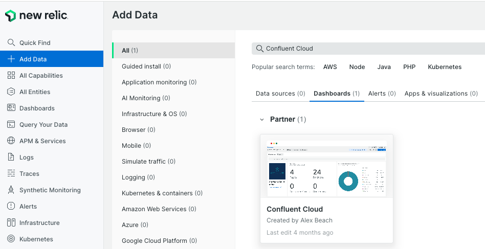
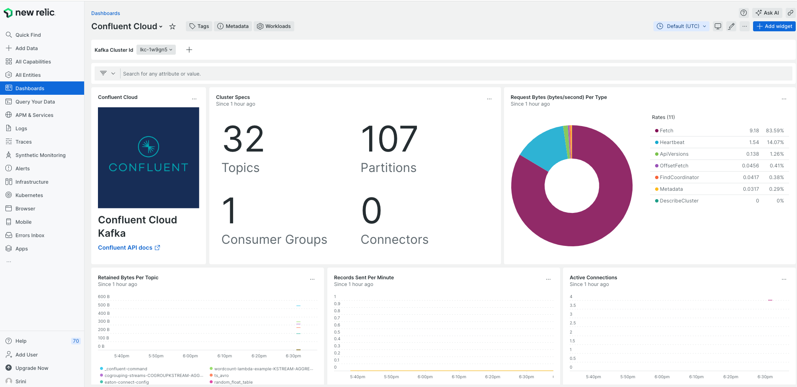
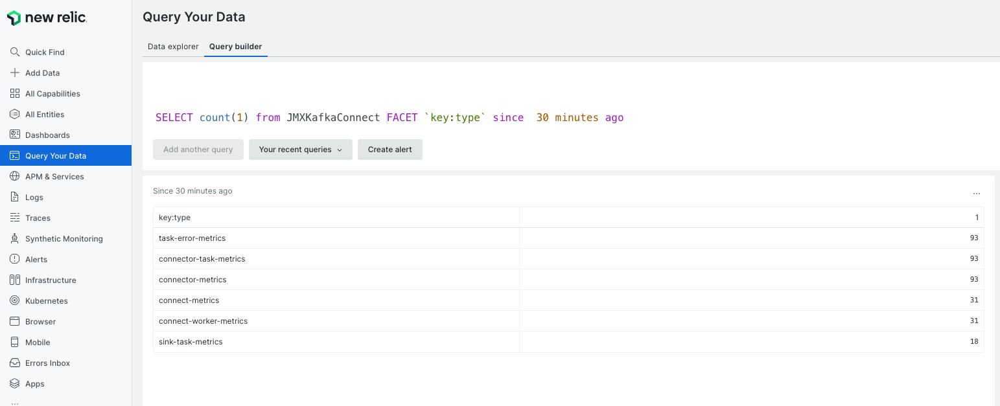
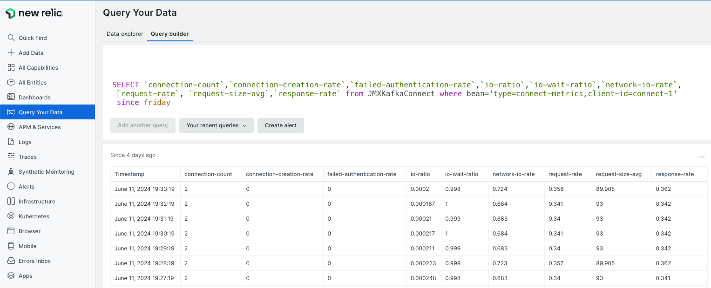

# NewRelic Monitoring
## Contents
- [Confluent Cloud](#Confluent-Cloud)
    - [Prerequisites](#Prerequisites)
    - [Clone NewRelic OpenTelemetry Collector](#Clone-NewRelic-OpenTelemetry-Collector-Repo)
    - [Configure the environment](#Configure-the-environment)
    - [Run the Collector](#Run-the-collector)
    - [Create the dashboard](#Create-the-dashboard)
- [JMX Monitoring](#JMX-Monitoring)
    - [Prerequisites](#Prerequisites)
    - [Install NewRelic Agent](#Install-NewRelic-Agent)
    - [Install NewRelic JMX Integration (nri-jmx)](#Install-NewRelic-JMX-Integration)
    - [Start Agent](#Start-Agent)
    - [Verify the metrics on NewRelic UI](#Verify-the-metrics-on-NewRelic-UI)
    - [Logs](#Logs)
    - [Debug](#Debug)
 
## Confluent cloud
### Prerequisites

#### New Relic
You need to create a New Relic account.

#### License Key
Once you have logged in to your account, you need to collect your Ingest Key which will be needed in the next steps. You can find it on your New Relic UI, from your Profile - API Keys menu. Find your INGEST - LICENSE | License Key and then Copy Key from the 3 dots options.

#### Docker + packages

https://docs.docker.com/engine/install/ubuntu/


### Clone NewRelic OpenTelemetry Collector Repo
```
[ubuntu@awst2x ~/customer/gep/newrelic]# git clone https://github.com/newrelic/newrelic-opentelemetry-examples
```
### Configure the environment
#### Configure docker-compose to add multiple clusters
```
[ubuntu@awst2x ~/customer/gep/newrelic/newrelic-opentelemetry-examples/other-examples/collector/confluentcloud]# cat docker-compose.yaml
version: "3.6"

services:

  otel-collector:
    image: otel/opentelemetry-collector-contrib:0.92.0
    command: --config=/etc/otelcol/config.yaml
    volumes:
      - ./collector.yaml:/etc/otelcol/config.yaml
    environment:
      - NEW_RELIC_OTLP_ENDPOINT
      - NEW_RELIC_API_KEY
      - CONFLUENT_API_KEY
      - CONFLUENT_API_SECRET
      - CLUSTER_ID_PRIMARY
      - CLUSTER_ID_SECONDARY
      - CONNECTOR_ID
      - SCHEMA_REGISTRY_ID
```
#### Configure the collector.yaml
> To monitor multiple clusters of same type add CLUSTER_ID_xxx in the resource.kafka.id section
```
[ubuntu@awst2x ~/customer/gep/newrelic/newrelic-opentelemetry-examples/other-examples/collector/confluentcloud]# cat collector.yaml
receivers:
  prometheus:
    config:
      scrape_configs:
        - job_name: "confluent"
          scrape_interval: 60s # Do not go any lower than this or you'll hit rate limits
          static_configs:
            - targets: ["api.telemetry.confluent.cloud"]
          scheme: https
          basic_auth:
            username: $CONFLUENT_API_KEY
            password: $CONFLUENT_API_SECRET
          metrics_path: /v2/metrics/cloud/export
          params:
            "resource.kafka.id":
              - $CLUSTER_ID_PRIMARY
              - $CLUSTER_ID_SECONDARY
      #  OPTIONAL - You can include monitoring for Confluent connectors or schema registry's by including the ID here.
            "resource.connector.id":
              - $CONNECTOR_ID
            "resource.schema_registry.id":
              - $SCHEMA_REGISTRY_ID

processors:
  batch:

exporters:
  otlphttp:
    endpoint: $NEW_RELIC_OTLP_ENDPOINT
    headers:
      api-key: $NEW_RELIC_API_KEY

service:
  pipelines:
    metrics:
      receivers: [prometheus]
      processors: [batch]
      exporters: [otlphttp]

```
#### Configure the .env with value for the variables in docker-compose and collector.yaml 
```
[ubuntu@awst2x ~/customer/gep/newrelic/newrelic-opentelemetry-examples/other-examples/collector/confluentcloud]# cat .env | grep -v ^#
NEW_RELIC_API_KEY=d0dad603fd922c9f4717fb205ce10a80FFFFNRAL
NEW_RELIC_OTLP_ENDPOINT=https://otlp.nr-data.net/
CONFLUENT_API_KEY=X6CY***********
CONFLUENT_API_SECRET=1nYG9LHV4wz**************
CLUSTER_ID_PRIMARY=lkc-p96zk2
CLUSTER_ID_SECONDARY=lkc-3w6270
SCHEMA_REGISTRY_ID=lsrc-vnk8qp
CONNECTOR_ID=lcc-zyk2dd
```
## Run the collector
```
[ubuntu@awst2x ~/customer/gep/newrelic/newrelic-opentelemetry-examples/other-examples/collector/confluentcloud]# docker compose up
```
<details>
  <summary>Output</summary>
  
  ```js
[+] Running 4/4
 ✔ otel-collector 3 layers [⣿⣿⣿]      0B/0B      Pulled                                                                                                                                                                                  3.7s
   ✔ 2f14d87263e3 Pull complete                                                                                                                                                                                                          0.3s
   ✔ 54ed1b43eeb3 Pull complete                                                                                                                                                                                                          2.9s
   ✔ 57780b645c57 Pull complete                                                                                                                                                                                                          2.9s
[+] Building 0.0s (0/0)
[+] Running 2/2
 ✔ Network confluentcloud_default             Created                                                                                                                                                                                    0.1s
 ✔ Container confluentcloud-otel-collector-1  Created                                                                                                                                                                                    1.0s
Attaching to confluentcloud-otel-collector-1
confluentcloud-otel-collector-1  | 2024-06-06T18:36:02.513Z     info    service@v0.92.0/telemetry.go:86 Setting up own telemetry...
confluentcloud-otel-collector-1  | 2024-06-06T18:36:02.514Z     info    service@v0.92.0/telemetry.go:159        Serving metrics {"address": ":8888", "level": "Basic"}
confluentcloud-otel-collector-1  | 2024-06-06T18:36:02.515Z     info    service@v0.92.0/service.go:151  Starting otelcol-contrib...     {"Version": "0.92.0", "NumCPU": 4}
confluentcloud-otel-collector-1  | 2024-06-06T18:36:02.515Z     info    extensions/extensions.go:34     Starting extensions...
confluentcloud-otel-collector-1  | 2024-06-06T18:36:02.515Z     info    prometheusreceiver@v0.92.0/metrics_receiver.go:240      Starting discovery manager      {"kind": "receiver", "name": "prometheus", "data_type": "metrics"}
confluentcloud-otel-collector-1  | 2024-06-06T18:36:02.515Z     info    prometheusreceiver@v0.92.0/metrics_receiver.go:231      Scrape job added        {"kind": "receiver", "name": "prometheus", "data_type": "metrics", "jobName": "confluent"}
confluentcloud-otel-collector-1  | 2024-06-06T18:36:02.515Z     info    service@v0.92.0/service.go:177  Everything is ready. Begin running and processing data.
confluentcloud-otel-collector-1  | 2024-06-06T18:36:02.515Z     info    prometheusreceiver@v0.92.0/metrics_receiver.go:282      Starting scrape manager {"kind": "receiver", "name": "prometheus", "data_type": "metrics"}
  ```
</details>

### Create the Dashboard
#### Import the Confluent Cloud from New Relic Market Place
[]()
[]()


## JMX Monitoring 
Use this approach to monitor self managed CP / Connect Cluster
### Prerequisites

#### New Relic
You need to create a New Relic account.

#### License Key
Once you have logged in to your account, you need to collect your Ingest Key which will be needed in the next steps. You can find it on your New Relic UI, from your Profile - API Keys menu. Find your INGEST - LICENSE | License Key and then Copy Key from the 3 dots options.

### Install NewRelic Agent
Reference: https://docs.newrelic.com/docs/infrastructure/install-infrastructure-agent/linux-installation/install-infrastructure-monitoring-agent-linux/

```
[ubuntu@awst2x ~/customer/gep/newrelic]# cat /etc/lsb-release
DISTRIB_ID=Ubuntu
DISTRIB_RELEASE=20.04
DISTRIB_CODENAME=focal
DISTRIB_DESCRIPTION="Ubuntu 20.04.6 LTS"

[ubuntu@awst2x ~/customer/gep/newrelic]# curl -fsSL https://download.newrelic.com/infrastructure_agent/gpg/newrelic-infra.gpg | sudo gpg --dearmor -o /etc/apt/trusted.gpg.d/newrelic-infra.gpg

[ubuntu@awst2x ~/customer/gep/newrelic]# echo "deb https://download.newrelic.com/infrastructure_agent/linux/apt focal main" | sudo tee -a /etc/apt/sources.list.d/newrelic-infra.list
deb https://download.newrelic.com/infrastructure_agent/linux/apt focal main

[ubuntu@awst2x ~/customer/gep/newrelic]# sudo apt-get update

[ubuntu@awst2x ~/customer/gep/newrelic]# sudo apt-get install newrelic-infra -y

[ubuntu@awst2x ~/customer/gep/newrelic]# newrelic-infra --version
New Relic Infrastructure Agent version: 1.52.3, GoVersion: go1.21.10, GitCommit: 83eb325f68a1714588b8f3deeba44e79da2e8e2f, BuildDate: 2024-05-15T07:33:02Z
```
### Configure the agent with the license
Ref: https://docs.newrelic.com/docs/infrastructure/install-infrastructure-agent/configuration/config-file-template-newrelic-infrayml/

```
[ubuntu@awst2x /etc]# grep license newrelic-infra.yml
# The infrastructure agent only requires the license key to be
# Option : license_key
license_key: d0dad603fd922c9f4717fb205ce10a80FFFFNRAL
```
### Install NewRelic JMX Integration 
nri-jmx 
```
[ubuntu@awst2x ~/customer/gep/newrelic]#  sudo apt-get install nri-jmx
```
### Configure the JMX and KafkaMetrics
```
[ubuntu@awst2x /etc/newrelic-infra/integrations.d]# ls -ltr | tail -2
-rw-rw-r-- 1 ubuntu ubuntu  340 Jun 10 15:04 jmx-config.yml
-rw-rw-r-- 1 ubuntu ubuntu 1347 Jun 11 19:16 kafka-metrics.yml
```
### Start Agent
> systemctl [start|stop|tatus|restart] newrelic-infra
```
[ubuntu@awst2x ~/customer/gep/newrelic]# sudo systemctl start newrelic-infra
```
### Verify the metrics on NewRelic UI
[]()
[]()

### Logs
```
journalctl -u newrelic-infra -n 1000 --no-pager
```
###  Debug
```
[ubuntu@awst2x ~/customer/gep/newrelic]# grep "log:" /etc/newrelic-infra.yml -A 3
log:
  level: debug
  file: /tmp/newrelic.log
```
