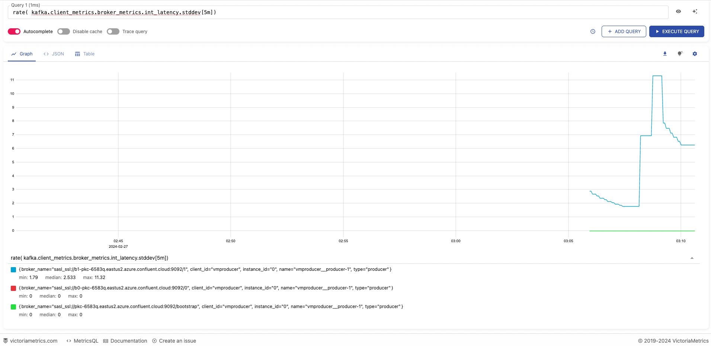

# Monitor Kafka client metrics with VictoriaMetrics 
A scalable monitoring solution and time series database (compatable with prometheus ) 
VictoriaMetrics accepts Prometheus querying API requests on port 8428.

You can
- set up scraping of Prometheus-compatible targets
- Push metrics in one of the supported formats using REST API
- Setup Grafana to build dashboards and query metrics
  
## Contents
- [Setup Victoria Metrics Database](#Setup-Victoria-Metrics-Server)
- [Data ingestion methods](#Data-ingestion-methods)
- [Push confluent client metrics to VictoriaMetrics](#Push-confluent-client-metrics-to-VictoriaMetrics)
- [Query Metrics](#Query-Metrics)
- [Metrics Reported](#Metrics-Reported)

## Setup Victoria Metrics Database in Docker
#### Pull the latest image
```
> docker pull victoriametrics/victoria-metrics:latest

latest: Pulling from victoriametrics/victoria-metrics
4abcf2066143: Pull complete 
b7492ce4cbe0: Pull complete 
f3886e6bdc05: Pull complete 
Digest: sha256:e25167523fc1788daaa73944c141cc8fcf80ccc77c6527c3d722d50eb4cb7757
Status: Downloaded newer image for victoriametrics/victoria-metrics:latest
docker.io/victoriametrics/victoria-metrics:latest
```
#### Run the docker container
```
> docker run -d -it --rm -v `pwd`/victoria-metrics-data:/victoria-metrics-data -p 8428:8428 victoriametrics/victoria-metrics:latest
cfaa499c6cec22d3076d0bbb2e7ae356498984c9f1f38ff32a52225217c1e9b0

> docker ps
CONTAINER ID   IMAGE                                     COMMAND                  CREATED          STATUS          PORTS                                       NAMES
cfaa499c6cec   victoriametrics/victoria-metrics:latest   "/victoria-metrics-p…"   19 minutes ago   Up 19 minutes   0.0.0.0:8428->8428/tcp, :::8428->8428/tcp   gifted_mendel
```
## Data Ingestion Methods
#### Prometheus Exposition Format 
```
> curl -d 'foo{bar="baz"} 123' -X POST 'http://localhost:8428/api/v1/import/prometheus'

> curl -G 'http://localhost:8428/api/v1/export' -d 'match={__name__=~"foo"}'
{"metric":{"__name__":"foo","bar":"baz"},"values":[123],"timestamps":[1707281476803]}
```
#### Push Gateway format
```
> curl -d 'metric{label="abc"} 123' -X POST 'http://localhost:8428/api/v1/import/prometheus/metrics/job/my_app/instance/host123'

> curl -G 'http://localhost:8428/api/v1/export' -d 'match[]={label="abc"}'
{"metric":{"__name__":"metric","job":"my_app","instance":"host123","label":"abc"},"values":[123],"timestamps":[1707281365957]}
```
#### CSV format
```
> curl -d "MSFT,3.21,1.67,NASDAQ" 'http://localhost:8428/api/v1/import/csv?format=2:metric:ask,3:metric:bid,1:label:ticker,4:label:market'

> curl -G 'http://localhost:8428/api/v1/export' -d 'match[]={ticker!=""}'
{"metric":{"__name__":"bid","market":"NASDAQ","ticker":"MSFT"},"values":[1.67],"timestamps":[1707282581153]}
{"metric":{"__name__":"ask","market":"NASDAQ","ticker":"MSFT"},"values":[3.21],"timestamps":[1707282581153]}
```
#### InfluxDBLine protocol ( supports multiple fields )
```
> curl -d 'measurement,tag1=value1,tag2=value2 field1=123,field2=1.23' -X POST 'http://localhost:8428/write'

> curl -G 'http://localhost:8428/api/v1/export' -d 'match={__name__=~"measurement_.*"}'
{"metric":{"__name__":"measurement_field2","tag1":"value1","tag2":"value2"},"values":[1.23],"timestamps":[1707418819938]}
{"metric":{"__name__":"measurement_field1","tag1":"value1","tag2":"value2"},"values":[123],"timestamps":[1707418819938]}
```
#### OpenMetrics  format

#### JSON line  format 

#### Convert JSON file to PROM format
```
jq -r 'keys_unsorted[] as $k | "\($k) \(.[$k])"' producer_stat.json > producer_stat.prom
```

## Push confluent client metrics to VictoriaMetrics
```
> ./producer.py
SUCCESS:Delivery site[None] topic[victoria-metric-test] partition[1] offset[212] timestamp[(1, 1709002995035)] value[b'{"FIELD1": "event1_75 - produce", "FIELD2": "bla", "FIELD3": "mock data from producer" }']
SUCCESS:Delivery site[None] topic[victoria-metric-test] partition[1] offset[213] timestamp[(1, 1709002996036)] value[b'{"FIELD1": "event2_75 - produce", "FIELD2": "bla", "FIELD3": "mock data from producer" }']
SUCCESS:Delivery site[None] topic[victoria-metric-test] partition[1] offset[214] timestamp[(1, 1709002997036)] value[b'{"FIELD1": "event3_75 - produce", "FIELD2": "bla", "FIELD3": "mock data from producer" }']
SUCCESS:Delivery site[None] topic[victoria-metric-test] partition[0] offset[147] timestamp[(1, 1709002998036)] value[b'{"FIELD1": "event4_75 - produce", "FIELD2": "bla", "FIELD3": "mock data from producer" }']
. . . .
SUCCESS:Delivery site[None] topic[victoria-metric-test] partition[1] offset[217] timestamp[(1, 1709003004039)] value[b'{"FIELD1": "event10_75 - produce", "FIELD2": "bla", "FIELD3": "mock data from producer" }']
stats_cb
SUCCESS:Delivery site[None] topic[victoria-metric-test] partition[1] offset[218] timestamp[(1, 1709003005039)] value[b'{"FIELD1": "event11_75 - produce", "FIELD2": "bla", "FIELD3": "mock data from producer" }']
. . . .
% Waiting for 0 deliveries
```

## Query Metrics 
#### VM UI
```
http://localhost:8428/vmui
```
> e.g rate( kafka.client_metrics.broker_metrics.int_latency.stddev[5m])

[]()

#### REST API
```
> curl -G 'http://localhost:8428/api/v1/export' -d 'match={__name__=~"kafka.client_metrics.tx_bytes"}'

{"metric":{"__name__":"kafka.client_metrics.tx_bytes","type":"producer","name":"SmartProducer__producer-4","client_id":"SmartProducer","instance_id":"0"},"values":[3180,3180,5440,3170,3180,5440,3180,5440,3180,5440,3170,5420,3170,3180,5440,7700,9960,3180,5440,7700,9960,2329,4589,6849,9109,3180,5440,7700,9960,3180,5440,7700,9960,3180,5440,7700,9960,3170,5420,7670,9920,3180,5440,7700,9960,3180,5440,7700,9960,3180],"timestamps":[1707942011477,1707943613781,1707943623774,1707944302125,1707952725607,1707952735607,1707952809608,1707952819605,1708008397577,1708008407553,1708025396395,1708025406384,1708025441884,1708639350967,1708639360898,1708639370863,1708639380867,1708639703763,1708639713762,1708639723764,1708639733758,1708640073300,1708640083299,1708640093293,1708640103289,1708640158362,1708640168356,1708640178450,1708640188372,1708640241165,1708640251164,1708640261174,1708640271157,1708640391822,1708640401821,1708640411853,1708640421815,1708641152528,1708641162517,1708641172504,1708641182512,1708641225603,1708641235608,1708641245608,1708641255615,1708642162911,1708642172895,1708642182870,1708642192890,1708642548317]}
{"metric":{"__name__":"kafka.client_metrics.tx_bytes","type":"consumer","name":"rdkafka__consumer-5","client_id":"rdkafka","instance_id":"0"},"values":[6884,12620,19068,25694,32022,38230],"timestamps":[1708642569195,1708642579194,1708642589196,1708642599197,1708642609196,1708642619184]}
{"metric":{"__name__":"kafka.client_metrics.tx_bytes","type":"producer","name":"SmartProducer__producer-5","client_id":"SmartProducer","instance_id":"0"},"values":[251,251,251,2995,5245,7495,251,251,251,3020,5280,7540],"timestamps":[1708025451378,1708025461484,1708025471630,1708025481904,1708025492294,1708025502098,1708642558910,1708642569017,1708642579164,1708642589844,1708642599629,1708642609451]}
```

### Metrics Reported
> :information_source: Below metrics are a compilation based on the design in victoria_metrics.py to pull a set of metrics for this demo, You can enhance to collect more metrics.
```
 kafka.client_metrics.age
 kafka.client_metrics.broker_metrics.buf_grow
 kafka.client_metrics.broker_metrics.connects
 kafka.client_metrics.broker_metrics.disconnects
 kafka.client_metrics.broker_metrics.int_latency.avg
 kafka.client_metrics.broker_metrics.int_latency.cnt
 kafka.client_metrics.broker_metrics.int_latency.hdrsize
 kafka.client_metrics.broker_metrics.int_latency.max
 kafka.client_metrics.broker_metrics.int_latency.min
 kafka.client_metrics.broker_metrics.int_latency.outofrange
 kafka.client_metrics.broker_metrics.int_latency.p50
 kafka.client_metrics.broker_metrics.int_latency.p75
 kafka.client_metrics.broker_metrics.int_latency.p90
 kafka.client_metrics.broker_metrics.int_latency.p95
 kafka.client_metrics.broker_metrics.int_latency.p99
 kafka.client_metrics.broker_metrics.int_latency.p99_99
 kafka.client_metrics.broker_metrics.int_latency.stddev
 kafka.client_metrics.broker_metrics.int_latency.sum
 kafka.client_metrics.broker_metrics.nodeid
 kafka.client_metrics.broker_metrics.outbuf_cnt
 kafka.client_metrics.broker_metrics.outbuf_latency.avg
 kafka.client_metrics.broker_metrics.outbuf_latency.cnt
 kafka.client_metrics.broker_metrics.outbuf_latency.hdrsize
 kafka.client_metrics.broker_metrics.outbuf_latency.max
 kafka.client_metrics.broker_metrics.outbuf_latency.min
 kafka.client_metrics.broker_metrics.outbuf_latency.outofrange
 kafka.client_metrics.broker_metrics.outbuf_latency.p50
 kafka.client_metrics.broker_metrics.outbuf_latency.p75
 kafka.client_metrics.broker_metrics.outbuf_latency.p90
 kafka.client_metrics.broker_metrics.outbuf_latency.p95
 kafka.client_metrics.broker_metrics.outbuf_latency.p99
 kafka.client_metrics.broker_metrics.outbuf_latency.p99_99
 kafka.client_metrics.broker_metrics.outbuf_latency.stddev
 kafka.client_metrics.broker_metrics.outbuf_latency.sum
 kafka.client_metrics.broker_metrics.outbuf_msg_cnt
 kafka.client_metrics.broker_metrics.req_timeouts
 kafka.client_metrics.broker_metrics.rtt.avg
 kafka.client_metrics.broker_metrics.rtt.cnt
 kafka.client_metrics.broker_metrics.rtt.hdrsize
 kafka.client_metrics.broker_metrics.rtt.max
 kafka.client_metrics.broker_metrics.rtt.min
 kafka.client_metrics.broker_metrics.rtt.outofrange
 kafka.client_metrics.broker_metrics.rtt.p50
 kafka.client_metrics.broker_metrics.rtt.p75
 kafka.client_metrics.broker_metrics.rtt.p90
 kafka.client_metrics.broker_metrics.rtt.p95
 kafka.client_metrics.broker_metrics.rtt.p99
 kafka.client_metrics.broker_metrics.rtt.p99_99
 kafka.client_metrics.broker_metrics.rtt.stddev
 kafka.client_metrics.broker_metrics.rtt.sum
 kafka.client_metrics.broker_metrics.rx
 kafka.client_metrics.broker_metrics.rxbytes
 kafka.client_metrics.broker_metrics.rxcorriderrs
 kafka.client_metrics.broker_metrics.rxerrs
 kafka.client_metrics.broker_metrics.rxidle
 kafka.client_metrics.broker_metrics.rxpartial
 kafka.client_metrics.broker_metrics.stateage
 kafka.client_metrics.broker_metrics.throttle.avg
 kafka.client_metrics.broker_metrics.throttle.cnt
 kafka.client_metrics.broker_metrics.throttle.hdrsize
 kafka.client_metrics.broker_metrics.throttle.max
 kafka.client_metrics.broker_metrics.throttle.min
 kafka.client_metrics.broker_metrics.throttle.outofrange
 kafka.client_metrics.broker_metrics.throttle.p50
 kafka.client_metrics.broker_metrics.throttle.p75
 kafka.client_metrics.broker_metrics.throttle.p90
 kafka.client_metrics.broker_metrics.throttle.p95
 kafka.client_metrics.broker_metrics.throttle.p99
 kafka.client_metrics.broker_metrics.throttle.p99_99
 kafka.client_metrics.broker_metrics.throttle.stddev
 kafka.client_metrics.broker_metrics.throttle.sum
 kafka.client_metrics.broker_metrics.tx
 kafka.client_metrics.broker_metrics.txbytes
 kafka.client_metrics.broker_metrics.txerrs
 kafka.client_metrics.broker_metrics.txidle
 kafka.client_metrics.broker_metrics.txretries
 kafka.client_metrics.broker_metrics.waitresp_cnt
 kafka.client_metrics.broker_metrics.waitresp_msg_cnt
 kafka.client_metrics.broker_metrics.wakeups
 kafka.client_metrics.broker_metrics.zbuf_grow
 kafka.client_metrics.cgrp_metrics.assignment_size
 kafka.client_metrics.cgrp_metrics.rebalance_age
 kafka.client_metrics.cgrp_metrics.rebalance_cnt
 kafka.client_metrics.cgrp_metrics.stateage
 kafka.client_metrics.metadata_cache_cnt
 kafka.client_metrics.msg_cnt
 kafka.client_metrics.msg_max
 kafka.client_metrics.msg_size
 kafka.client_metrics.msg_size_max
 kafka.client_metrics.replyq
 kafka.client_metrics.rx
 kafka.client_metrics.rx_bytes
 kafka.client_metrics.rxmsg_bytes
 kafka.client_metrics.rxmsgs
 kafka.client_metrics.simple_cnt
 kafka.client_metrics.time
 kafka.client_metrics.topic_metrics.age
 kafka.client_metrics.topic_metrics.batchcnt.avg
 kafka.client_metrics.topic_metrics.batchcnt.cnt
 kafka.client_metrics.topic_metrics.batchcnt.hdrsize
 kafka.client_metrics.topic_metrics.batchcnt.max
 kafka.client_metrics.topic_metrics.batchcnt.min
 kafka.client_metrics.topic_metrics.batchcnt.outofrange
 kafka.client_metrics.topic_metrics.batchcnt.p50
 kafka.client_metrics.topic_metrics.batchcnt.p75
 kafka.client_metrics.topic_metrics.batchcnt.p90
 kafka.client_metrics.topic_metrics.batchcnt.p95
 kafka.client_metrics.topic_metrics.batchcnt.p99
 kafka.client_metrics.topic_metrics.batchcnt.p99_99
 kafka.client_metrics.topic_metrics.batchcnt.stddev
 kafka.client_metrics.topic_metrics.batchcnt.sum
 kafka.client_metrics.topic_metrics.batchsize.avg
 kafka.client_metrics.topic_metrics.batchsize.cnt
 kafka.client_metrics.topic_metrics.batchsize.hdrsize
 kafka.client_metrics.topic_metrics.batchsize.max
 kafka.client_metrics.topic_metrics.batchsize.min
 kafka.client_metrics.topic_metrics.batchsize.outofrange
 kafka.client_metrics.topic_metrics.batchsize.p50
 kafka.client_metrics.topic_metrics.batchsize.p75
 kafka.client_metrics.topic_metrics.batchsize.p90
 kafka.client_metrics.topic_metrics.batchsize.p95
 kafka.client_metrics.topic_metrics.batchsize.p99
 kafka.client_metrics.topic_metrics.batchsize.p99_99
 kafka.client_metrics.topic_metrics.batchsize.stddev
 kafka.client_metrics.topic_metrics.batchsize.sum
 kafka.client_metrics.topic_metrics.metadata_age
 kafka.client_metrics.topic_metrics.partition_metrics.acked_msgid
 kafka.client_metrics.topic_metrics.partition_metrics.app_offset
 kafka.client_metrics.topic_metrics.partition_metrics.broker
 kafka.client_metrics.topic_metrics.partition_metrics.commited_offset
 kafka.client_metrics.topic_metrics.partition_metrics.committed_leader_epoch
 kafka.client_metrics.topic_metrics.partition_metrics.committed_offset
 kafka.client_metrics.topic_metrics.partition_metrics.consumer_lag
 kafka.client_metrics.topic_metrics.partition_metrics.consumer_lag_stored
 kafka.client_metrics.topic_metrics.partition_metrics.desired
 kafka.client_metrics.topic_metrics.partition_metrics.eof_offset
 kafka.client_metrics.topic_metrics.partition_metrics.fetchq_cnt
 kafka.client_metrics.topic_metrics.partition_metrics.fetchq_size
 kafka.client_metrics.topic_metrics.partition_metrics.hi_offset
 kafka.client_metrics.topic_metrics.partition_metrics.leader
 kafka.client_metrics.topic_metrics.partition_metrics.leader_epoch
 kafka.client_metrics.topic_metrics.partition_metrics.lo_offset
 kafka.client_metrics.topic_metrics.partition_metrics.ls_offset
 kafka.client_metrics.topic_metrics.partition_metrics.msgq_bytes
 kafka.client_metrics.topic_metrics.partition_metrics.msgq_cnt
 kafka.client_metrics.topic_metrics.partition_metrics.msgs
 kafka.client_metrics.topic_metrics.partition_metrics.msgs_inflight
 kafka.client_metrics.topic_metrics.partition_metrics.next_ack_seq
 kafka.client_metrics.topic_metrics.partition_metrics.next_err_seq
 kafka.client_metrics.topic_metrics.partition_metrics.next_offset
 kafka.client_metrics.topic_metrics.partition_metrics.partition
 kafka.client_metrics.topic_metrics.partition_metrics.query_offset
 kafka.client_metrics.topic_metrics.partition_metrics.rx_ver_drops
 kafka.client_metrics.topic_metrics.partition_metrics.rxbytes
 kafka.client_metrics.topic_metrics.partition_metrics.rxmsgs
 kafka.client_metrics.topic_metrics.partition_metrics.stored_leader_epoch
 kafka.client_metrics.topic_metrics.partition_metrics.stored_offset
 kafka.client_metrics.topic_metrics.partition_metrics.txbytes
 kafka.client_metrics.topic_metrics.partition_metrics.txmsgs
 kafka.client_metrics.topic_metrics.partition_metrics.unknown
 kafka.client_metrics.topic_metrics.partition_metrics.xmit_msgq_bytes
 kafka.client_metrics.topic_metrics.partition_metrics.xmit_msgq_cnt
 kafka.client_metrics.ts
 kafka.client_metrics.tx
 kafka.client_metrics.tx_bytes
 kafka.client_metrics.txmsg_bytes
 kafka.client_metrics.txmsgs
```
